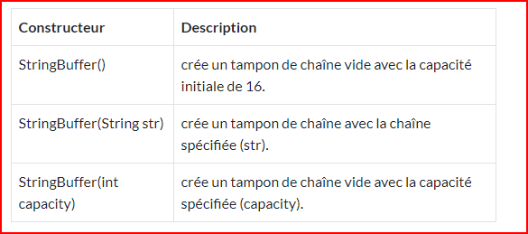

# cour 13 : Les chaine des caractéres 


## I. class String :


### 1.Définiton :

En Java, les chaînes de caractères sont représentées par la classe `String`, qui offre de nombreuses méthodes pour travailler avec des chaînes. Les chaînes en Java sont immuables, ce qui signifie qu'une fois qu'une chaîne est créée, elle ne peut pas être modifiée. Toute opération qui semble modifier une chaîne en crée en réalité une nouvelle instance de chaîne.


Les chaînes des caractéres  peuvent être construites de différentes manières. Le plus simple est d'utiliser une déclaration comme celle-ci :
```java 
// Méthode 1 : 
String chaine = "Bonjour";

// Méthode 2 : 
String autreMessage = new String("Hello, World!");
```

### RQ :

- Si vous devez modifier une chaîne, vous pouvez toujours en créer une nouvelle contenant les modifications:

```java 
String chaine = "Bonjour " ;

chaine = "Hello " ;
```

- Java définit les classes homologues de String, appelées StringBuffer et StringBuilder, qui permettent la modification de chaînes, de sorte que toutes les manipulations de chaîne normales sont toujours disponibles en Java.

### 2.Les Méthodes de ``class String``:

**a. length():**

- la méthode length() renvoie le nombre de caractères contenus dans l'objet chaîne.

Exemple : 

```java 
String welcome = "Hello";
System.out.println("Taille : " + welcome.length());
// Taille : 5
```

**b. concat():**

- La Méthode concat() permet de concatener deux chaine de caractéres à une seulle chaine : 

Exemple : 

```java 
String chaine1 = "Bonjour ";
String chaine2 = "Tout le mond !!";
String res = chaine1.concat(chaine2);

System.out.println(res); // Bonjour Tout le mond !!

```

####  RQ : 
- ``+`` : L'opération + peut concaténer deux chaine mais la Méthode ``.conact()`` est plus optimale . 


**c. substring():**

La méthode `substring()` est utilisée pour extraire une partie spécifique d'une chaîne de caractères.

```java
public String substring(int beginIndex, int endIndex)
```

- `beginIndex` : L'indice de début inclusif, indiquant où la sous-chaîne doit commencer.
- `endIndex` : L'indice de fin exclusif, indiquant où la sous-chaîne doit se terminer. Le caractère à cet indice ne sera pas inclus dans la sous-chaîne résultante.


Exemple :

```java
String phrase = "La vie est belle";
String sousPhrase = phrase.substring(3, 10); // extrait "vie est"
```

**d. ``contains`` && ``indexOf`` :**

- **contains() :**


La méthode `contains()` est utilisée pour vérifier si une sous-chaîne donnée est présente dans une chaîne donnée. Elle renvoie `true` si la sous-chaîne est trouvée, sinon elle renvoie `false`. Voici la signature de la méthode :

```java
public boolean contains(CharSequence sequence)
```

- **indexOf():**

La méthode `indexOf()` est utilisée pour trouver la première occurrence d'une sous-chaîne dans une chaîne donnée. Elle renvoie l'indice de la première occurrence de la sous-chaîne, ou -1 si la sous-chaîne n'est pas trouvée. Voici la signature de la méthode :

```java
public int indexOf(String str)
```

#### RQ : 

La méthode `indexOf()` peut également prendre un deuxième argument, `fromIndex`, qui spécifie à partir de quel indice la recherche doit commencer .


Exemple : 

```java
String phrase = "Java est génial";
boolean contientJava = phrase.contains("Java"); // renvoie true
int indice = phrase.indexOf("génial"); // renvoie 9
```


**e. replace():**

La méthode `replace()` est utilisée pour remplacer toutes les occurrences d'une sous-chaîne spécifiée par une autre sous-chaîne dans une chaîne donnée. Elle renvoie une nouvelle chaîne où les remplacements ont été effectués. Voici la signature de la méthode :

```java
public String replace(CharSequence target, CharSequence replacement)
```

- `target` : La sous-chaîne à remplacer.
- `replacement` : La sous-chaîne qui sera utilisée pour remplacer chaque occurrence de `target`.

Exemple :

```java
String texte = "Bonjour, mon ami!";
String nouveauTexte = texte.replace("ami", "chéri");
```

**f. toUpperCase() && toLowerCase() :** 

Conversion en Majuscules ou en Minuscules : 

```java
String mot = "Programmation";
String majuscules = mot.toUpperCase(); // renvoie "PROGRAMMATION"
String minuscules = mot.toLowerCase(); // renvoie "programmation"
```

**g. trim() :**

``trim()`` : Suppression des Espaces en Début et en Fin de Chaîne

```java
String espacees = "    Bonjour    ";
String sansEspaces = espacees.trim(); // renvoie "Bonjour"
```

**h. split():**

Cette méthode est utilisée pour diviser une chaîne en un tableau de sous-chaînes en utilisant un délimiteur spécifié. Chaque fois que le délimiteur est trouvé dans la chaîne, la chaîne est coupée à cet endroit et le résultat est stocké dans un tableau.

Voici la signature de la méthode `split()` :

```java
public String[] split(String regex)
```

- `regex` : Une expression régulière (regex) ou simplement une chaîne de caractères à utiliser comme délimiteur.

Exemple avec un délimiteur simple :

```java
String texte = "pomme,orange,banane";
String[] fruits = texte.split(",");
// Résultat : ["pomme", "orange", "banane"]
```


**i. ``equals()`` && ``equalsIgnoreCase`` :**

- **Comparaison de Contenu : equals()**

```java
String mot1 = "Bonjour";
String mot2 = "Bonjour";
boolean memesMots = mot1.equals(mot2); // renvoie true
```

- **Comparaison en Ignorant la Casse :  equalsIgnoreCase()**
```java
String texte1 = "Java";
String texte2 = "java";
boolean memeTexte = texte1.equalsIgnoreCase(texte2); // renvoie true

```

#### RQ : 
N'utilisez pas l'opérateur ``==`` pour vérifier si deux chaînes sont égales! Il détermine uniquement si les chaînes sont stockées au même endroit. Bien sûr, si les chaînes sont au même endroit, elles doivent être égales. Mais il est tout à fait possible de stocker plusieurs copies de chaînes identiques à des endroits différents.

**j. charAt() :**

La méthode `charAt()` en Java est utilisée pour obtenir le caractère à une position spécifique dans une chaîne. Elle prend un index en argument et renvoie le caractère situé à cet index dans la chaîne. 

Voici la signature de la méthode `charAt()` :

```java
public char charAt(int index)
```

- `index` : L'index de l'emplacement du caractère à obtenir.

Exemple :

```java
String texte = "Bonjour";
char premierCaractere = texte.charAt(0); // Renvoie 'B'
char cinquiemeCaractere = texte.charAt(4); // Renvoie 'o'
```

**k. compareTo():**

La méthode `compareTo()` en Java est utilisée pour comparer deux chaînes de caractères lexicographiquement (dans l'ordre alphabétique). Cette méthode est présente dans la classe `String` et renvoie un entier indiquant comment les deux chaînes se comparent.

Voici la signature de la méthode `compareTo()` :

```java
public int compareTo(String autreChaine)
```

- `autreChaine` : La chaîne à comparer avec la chaîne actuelle.

Le résultat de `compareTo()` est un entier qui peut avoir trois valeurs possibles :

- Une valeur négative si la chaîne actuelle est lexicographiquement inférieure à `autreChaine`.
- Zéro si les deux chaînes sont égales.
- Une valeur positive si la chaîne actuelle est lexicographiquement supérieure à `autreChaine`.

Exemples :

```java
String chaine1 = "apple";
String chaine2 = "banana";
String chaine3 = "apple";

int resultat1 = chaine1.compareTo(chaine2); // Renvoie une valeur négative
int resultat2 = chaine1.compareTo(chaine3); // Renvoie zéro
int resultat3 = chaine2.compareTo(chaine1); // Renvoie une valeur positive
```


#### RQ : 

La méthode `compareTo()` prend en compte les valeurs ASCII des caractères lors de la comparaison. Les lettres majuscules sont considérées comme inférieures aux lettres minuscules (par exemple, 'A' est inférieur à 'a').

Exemple : 

```java 

        String lettre1 = "a";
        String lettre2 = "A";

        System.out.println(lettre1.compareTo(lettre2)); // 32: le decalmage entre "a" et "A" en table ascii. 


```

**l. join():**

la méthode `join()` introduite dans Java 8. C'est une méthode statique ajoutée à la classe `String` et est utilisée pour joindre plusieurs éléments d'une collection ou d'un tableau en une seule chaîne de caractères, en utilisant un séparateur spécifié.

Voici la signature de la méthode `join()` :

```java
public static String join(CharSequence delimiter, CharSequence... elements)
```

- `delimiter` : Le séparateur à utiliser pour joindre les éléments.
- `elements` : Les éléments à joindre.

Exemple :

```java
String[] mots = {"Bonjour", "à", "tous"};
String resultat = String.join(" ", mots); // Résultat : "Bonjour à tous"
```


###  3.Chaînes Formatées :

Le formatage de chaînes en Java est une technique qui permet d'insérer des valeurs dans une chaîne en utilisant des spécificateurs de format. Cela permet de créer des chaînes formatées avec un contrôle précis sur la mise en forme des valeurs. Java propose plusieurs méthodes pour effectuer le formatage de chaînes, mais l'une des plus couramment utilisées est `String.format()`.

**3.1 Méthode `String.format()`:**

La méthode `String.format()` permet de créer une chaîne formatée en utilisant des spécificateurs de format. Un spécificateur de format commence par `%` suivi d'un caractère qui indique le type de valeur à insérer et la mise en forme souhaitée. Voici un exemple :

```java
String nom = "Alice";
int age = 30;
String message = String.format("Bonjour, je m'appelle %s et j'ai %d ans.", nom, age);
```

#### RQ : 

- Voici quelques exemples de spécificateurs de format couramment utilisés :

- `%s` : Chaîne
- `%d` : Entier signé
- `%f` : Nombre à virgule flottante
- `%c` : Caractère
- `%b` : Booléen
- `%x` : Entier en base hexadécimale

- Vous pouvez également contrôler la largeur et la précision du champ de format en utilisant des chiffres après `%`. Par exemple :

```java
double valeur = 123.456;
String format = String.format("La valeur est %.2f", valeur);
// Résultat : "La valeur est 123.46"
```


**3.2 : Méthode `System.out.printf()`:**

Une autre utilisation courante du formatage de chaînes est via la méthode `System.out.printf()`. Cette méthode fonctionne de manière similaire à `String.format()`, mais elle envoie la chaîne formatée directement à la sortie standard (généralement la console).

Exemple :

```java
double prix = 19.99;
System.out.printf("Le prix est : %.2f \n", prix);
// Affiche : "Le prix est : 19.99"
```

## II. Les classes ``StringBuffer`` et ``StringBuilder`` : 

En Java, les classes `StringBuffer` et `StringBuilder` sont utilisées pour manipuler efficacement des chaînes de caractères modifiables. Contrairement à la classe `String`, qui est immuable (ne peut pas être modifiée après sa création), les classes `StringBuffer` et `StringBuilder` permettent de modifier les chaînes de caractères sans recréer de nouvelles instances à chaque opération.

### 1.StringBuffer:

La classe `StringBuffer` est présente dans Java depuis les premières versions et elle est principalement utilisée dans des contextes multithread, car elle est synchronisée, ce qui la rend sûre pour une utilisation simultanée par plusieurs threads. Cependant, en raison de cette synchronisation, elle peut être moins performante dans les scénarios où la concurrence n'est pas un problème.

**a.Création d'un StringBuffer:**

```java
StringBuffer buffer = new StringBuffer(); // Crée une chaîne vide
StringBuffer bufferAvecContenu = new StringBuffer("Hello"); // Crée un StringBuffer avec du contenu initial
```

**b.Constructeurs de StringBuffer:**




**c.Opérations sur StringBuffer:**

- `capacity() :`
    La méthode `capacity()`   est utilisée pour obtenir la capacité actuelle du tampon de la chaîne 
    contenue dans l'objet `StringBuffer`.

    Voici la signature de la méthode `capacity()` :
    ```java
    public int capacity()
    ```

    Exemple :

    ```java
    StringBuffer buffer = new StringBuffer("Hello");
    int capacite = buffer.capacity();
    System.out.println("Capacité du StringBuffer : " + capacite);
    ```

    #### RQ : 

    Si vous ajoutez du contenu au-delà de la capacité initiale, le `StringBuffer` sera 
    agrandi pour accueillir le contenu supplémentaire. L'augmentation de la capacité est 
    généralement réalisée en allouant un nouveau tampon plus grand et en copiant le contenu 
    existant.


- `append()` : Ajoute une valeur à la fin du StringBuffer:
    ```java
        StringBuffer chaineBuffer = new StringBuffer("Bonjour ");
        chaineBuffer.append("Tout le mond!!");

    ```
- `insert()` : Insère une valeur à une position spécifiée dans le StringBuffer.
    ```java
        StringBuffer chaineBuffer = new StringBuffer("Tout le mond !!");
        chaineBuffer.insert(0,"Bonjour");     
    ```
- `delete()` : Supprime une portion de contenu du StringBuffer.

    La méthode `delete()` est utilisée pour supprimer une portion de contenu de la chaîne contenue  
    dans un objet `StringBuffer`. Elle prend deux arguments : l'indice de début (inclusif) et 
    l'indice de fin (exclusif) de la portion à supprimer. Après l'appel à cette méthode, la chaîne 
    contenue dans le `StringBuffer` est modifiée en conséquence.

    Voici la signature de la méthode `delete()` :

    ```java
    public StringBuffer delete(int startIndex, int endIndex)
    ```
    Exemple :

    ```java
    StringBuffer buffer = new StringBuffer("Hello, World!");
    buffer.delete(5, 7); // Supprime la portion de l'indice 5 (inclusif) à l'indice 7 (exclusif)
    // Résultat : "Hello World!"
    ```


- `reverse()` : Inverse le contenu du StringBuffer.
    ```java
    StringBuffer buffer = new StringBuffer("Hello");
    buffer.reverse(); // olleH
    ```

#### RQ : 

Presque toutes les méthodes disponibles dans la classe ``String`` sont également disponibles et valides pour la classe ``StringBuffer`` .


### 2.StringBuilder :


La classe `StringBuilder`, introduite dans Java 5, est similaire à `StringBuffer` mais n'est pas synchronisée, ce qui la rend plus performante dans des contextes non multithread. Elle est préférée dans la plupart des scénarios où la synchronisation n'est pas nécessaire.

**a.Création d'un StringBuilder:**

```java
StringBuilder builder = new StringBuilder(); // Crée une chaîne vide
StringBuilder builderAvecContenu = new StringBuilder("Hello"); // Crée un StringBuilder avec du contenu initial
```

**b.Opérations sur StringBuilder:**

Les opérations sur `StringBuilder` sont similaires à celles de `StringBuffer`.

```java
StringBuilder builder = new StringBuilder("Hello");
builder.append(" World"); // "Hello World"
builder.insert(5, ","); // "Hello, World"
builder.delete(5, 7); // "Hello World"
builder.replace(0, 5, "Hi"); // "Hi World"
builder.reverse(); // "dlroW iH"
```


### 3.Quand Utiliser StringBuffer ou StringBuilder :

- Utilisez `StringBuffer` lorsque vous travaillez dans un environnement multithread et avez besoin de garantir la synchronisation entre les threads.
- Utilisez `StringBuilder` dans des scénarios non multithread où vous privilégiez la performance.


