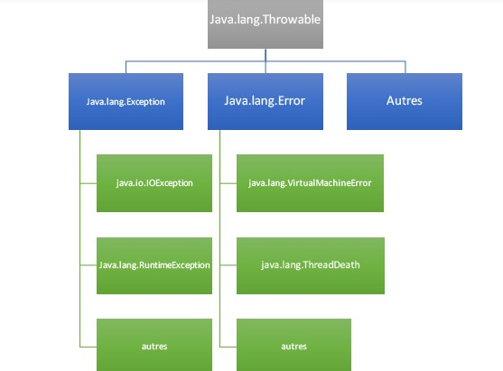

# cour 16 : Les exceptions 

Les exceptions sont des événements qui se produisent pendant l'exécution d'un programme et qui perturbent le flux normal d'exécution. En Java, les exceptions sont des objets qui encapsulent des informations sur les erreurs ou les situations exceptionnelles qui se produisent pendant l'exécution d'un programme. 

### 1.Types d'Exceptions:

En Java, les exceptions sont regroupées en trois catégories principales :

1. **Exceptions vérifiées (Checked Exceptions)** : Ces exceptions doivent être gérées explicitement par le programmeur. Elles sont souvent liées à des problèmes externes, tels que la lecture/écriture de fichiers et les opérations réseau. Par exemple, `IOException`, `FileNotFoundException`.

2. **Exceptions non vérifiées (Unchecked Exceptions)** : Ces exceptions ne nécessitent pas une gestion explicite. Elles sont généralement des erreurs de programmation, comme la division par zéro, l'accès à un index incorrect dans un tableau, etc. Par exemple, `ArithmeticException`, `NullPointerException`.

3. **Erreurs (Errors)** : Ce sont des conditions graves qui ne peuvent souvent pas être gérées par le programmeur. Par exemple, `OutOfMemoryError`, `StackOverflowError`.


### 2. Exemples dex Exceptions :  

voici quelques exemples d'exceptions courantes en Java :

#### a. `NullPointerException`

```java
public class NullPointerExceptionExample {
    public static void main(String[] args) {
        String str = null;
        int length = str.length(); // Provoque une NullPointerException
    }
}
```

**Explication :** Une `NullPointerException` se produit lorsque vous essayez d'accéder à un membre (méthode ou champ) d'un objet qui a la valeur `null`. Dans l'exemple ci-dessus, la variable `str` est `null`, donc l'appel à `str.length()` provoque une `NullPointerException`.

#### b. `ArrayIndexOutOfBoundsException`

```java
public class ArrayIndexOutOfBoundsExceptionExample {
    public static void main(String[] args) {
        int[] numbers = { 1, 2, 3 };
        int value = numbers[5]; // Provoque une ArrayIndexOutOfBoundsException
    }
}
```

**Explication :** Cette exception survient lorsque vous essayez d'accéder à un index non valide dans un tableau. Dans l'exemple ci-dessus, le tableau `numbers` a une longueur de 3, mais nous essayons d'accéder à l'élément à l'index 5, ce qui provoque une `ArrayIndexOutOfBoundsException`.

#### c. `ArithmeticException`

```java
public class ArithmeticExceptionExample {
    public static void main(String[] args) {
        int result = 10 / 0; // Provoque une ArithmeticException
    }
}
```

**Explication :** Une `ArithmeticException` se produit lorsque vous effectuez une opération mathématique incorrecte, telle que la division par zéro (0). Dans l'exemple ci-dessus, nous essayons de diviser 10 par 0, ce qui provoque une `ArithmeticException`.


#### d. `NumberFormatException`

```java
public class NumberFormatExceptionExample {
    public static void main(String[] args) {
        String str = "abc";
        int number = Integer.parseInt(str); // Provoque une NumberFormatException
    }
}
```

**Explication :** Une `NumberFormatException` se produit lorsque vous essayez de convertir une chaîne en un nombre, mais la chaîne ne peut pas être analysée en tant que nombre. Dans l'exemple ci-dessus, la chaîne `"abc"` ne peut pas être convertie en un nombre entier, ce qui provoque une `NumberFormatException`.

Bien sûr, voici des exemples d'autres exceptions courantes en Java, accompagnés d'explications sur leur utilisation et des circonstances dans lesquelles elles peuvent se produire :

#### e. `IllegalArgumentException`

```java
public class IllegalArgumentExceptionExample {
    public static void main(String[] args) {
        int age = -5;
        if (age < 0) {
            throw new IllegalArgumentException("L'âge ne peut pas être négatif");
        }
    }
}
```

**Explication :** Une `IllegalArgumentException` est levée lorsque vous passez un argument à une méthode qui est invalide ou incompatible avec l'opération. Dans l'exemple ci-dessus, nous lançons cette exception si l'âge est négatif, car cela ne correspond pas à une valeur valide pour l'âge.


#### f. `InputMismatchException` :

L'exception `InputMismatchException` est une exception spécifique à la manipulation de données avec la classe `Scanner` en Java. Elle fait partie du package `java.util` et est utilisée pour signaler qu'une incompatibilité de type s'est produite lors de la lecture des données à partir d'un flux d'entrée.

Cette exception est souvent levée lorsque le type de données attendu ne correspond pas au type réel trouvé dans le flux d'entrée. Par exemple, si vous attendez une valeur entière (int) et que l'utilisateur entre une chaîne de caractères, une `InputMismatchException` sera levée.

Voici un exemple pour illustrer l'utilisation de `InputMismatchException` avec la classe `Scanner` :

```java
import java.util.Scanner;
import java.util.InputMismatchException;

public class InputMismatchExceptionExample {
    public static void main(String[] args) {
        Scanner scanner = new Scanner(System.in);

        try {
            System.out.print("Entrez un entier : ");
            int num = scanner.nextInt(); // Peut provoquer InputMismatchException
            System.out.println("Vous avez entré : " + num);
        } catch (InputMismatchException e) {
            System.out.println("Erreur de type : " + e.getMessage());
        }

        scanner.close();
    }
}
```


### 3. Blocs Try-Catch

Pour gérer les exceptions en Java, vous pouvez utiliser les blocs `try` et `catch`. Un bloc `try` englobe le code qui peut provoquer une exception, tandis qu'un ou plusieurs blocs `catch` spécifient comment gérer chaque type d'exception possible.

```java
try {
    // Code pouvant provoquer une exception
} catch (TypeException e) {
    // Traitement de l'exception de type TypeException
} catch (AutreTypeException e) {
    // Traitement de l'exception de type AutreTypeException
} finally {
    // Code exécuté quel que soit le résultat (optionnel)
}
```

Exemple : 

```java
public class TryCatchExample {
    public static void main(String[] args) {
        int[] numbers = { 1, 2, 3 };

        try {
            System.out.println(numbers[5]); // Tentative d'accéder à un index inexistant
        } catch (ArrayIndexOutOfBoundsException e) {
            System.out.println("Erreur : Index hors limites");
        }
    }
}
```


### 4. Bloc Finally

Le bloc `finally` est utilisé pour spécifier un code qui sera exécuté qu'une exception soit levée ou non. Il est souvent utilisé pour effectuer des tâches de nettoyage ou de fermeture de ressources.

Exemple : 

```java

import java.util.Scanner;
import java.util.InputMismatchException;

public class App {

    public static void main(String[] args) {
        Scanner scanner = new Scanner(System.in);

        try {
            System.out.println("Entrez votre age svp : ");

            int age = scanner.nextInt();

        } catch (InputMismatchException e) {
            System.out.println("la sasie d'age est invaliede");
        } finally {
            scanner.close();
        }

    }

}


```

### 5. Lancer des Exceptions

En Java, vous pouvez également lancer des exceptions à l'aide du mot-clé `throw`. Cela permet à votre code de signaler une situation exceptionnelle à un niveau supérieur.

```java
if (condition) {
    throw new MonException("Message d'erreur");
}
```

Exemple : 

```java
public class ThrowExample {
    public static void main(String[] args) {
        int age = -5;

        try {
            if (age < 0) {
                throw new IllegalArgumentException("L'âge ne peut pas être négatif");
            }
        } catch (IllegalArgumentException e) {
            System.out.println("Erreur : " + e.getMessage());
        }
    }
}
```


### 6. Personnaliser les Exceptions

Vous pouvez également créer vos propres classes d'exception personnalisées en étendant la classe `Exception` ou l'une de ses sous-classes.

```java
class MonException extends Exception {
    // Constructeurs et méthodes spécifiques
}
```

### 7. Les Méthodes de la classe ``Exception``:

La classe `Exception` en Java est la classe de base pour toutes les exceptions. Elle offre plusieurs méthodes pour obtenir des informations sur l'exception qui s'est produite. Voici quelques-unes des méthodes les plus couramment utilisées de la classe `Exception` :

1. **`getMessage()`** : Cette méthode renvoie le message associé à l'exception. Ce message peut être défini lors de la création de l'exception pour fournir des informations sur la cause de l'exception.

   ```java
   try {
       // code susceptible de lever une exception
   } catch (Exception e) {
       System.out.println("Erreur : " + e.getMessage());
   }
   ```

2. **`printStackTrace()`** : Cette méthode affiche la trace de la pile (stack trace) de l'exception, c'est-à-dire la liste des méthodes et des lignes de code qui ont conduit à l'exception. Cela aide à identifier l'endroit exact où l'exception s'est produite.

   ```java
   try {
       // code susceptible de lever une exception
   } catch (Exception e) {
       e.printStackTrace();
   }
   ```

3. **`toString()`** : Cette méthode renvoie une représentation sous forme de chaîne de l'exception, généralement au format `"NomDeLaClasse: message"`. Elle est utilisée implicitement lorsque vous concaténez une exception avec une chaîne.

   ```java
   try {
       // code susceptible de lever une exception
   } catch (Exception e) {
       System.out.println("Exception : " + e);
   }
   ```

4. **`getCause()`** : Cette méthode renvoie la cause sous-jacente de l'exception, si elle a été spécifiée. Elle est utile pour récupérer la cause originale d'une exception.

   ```java
   try {
       // code susceptible de lever une exception
   } catch (Exception e) {
       Throwable cause = e.getCause();
       if (cause != null) {
           System.out.println("Cause : " + cause.getMessage());
       }
   }
   ```

5. **`getStackTrace()`** : Cette méthode renvoie un tableau d'objets `StackTraceElement` qui représentent la trace de la pile de l'exception. Vous pouvez utiliser cette méthode pour obtenir des informations plus détaillées sur chaque élément de la trace.

   ```java
   try {
       // code susceptible de lever une exception
   } catch (Exception e) {
       StackTraceElement[] stackTrace = e.getStackTrace();
       for (StackTraceElement element : stackTrace) {
           System.out.println("Méthode : " + element.getMethodName());
           System.out.println("Fichier : " + element.getFileName());
           System.out.println("Ligne : " + element.getLineNumber());
       }
   }
   ```

En utilisant ces méthodes, vous pouvez obtenir des informations précieuses sur les exceptions qui se sont produites et les raisons sous-jacentes, ce qui facilite le débogage et la gestion des erreurs dans votre code.


#### RQ : 

la figure suivante montre la hiérarchie des exceptions : 
