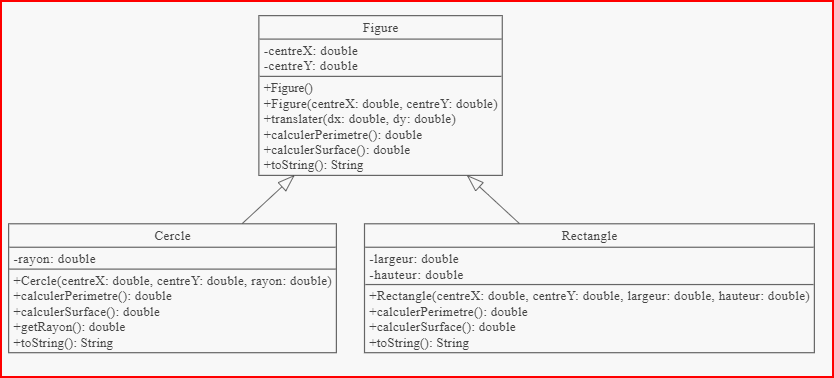

# cour 18 :les Classes Abstraites en Java


### 1.Définition :

- Les classes abstraites sont un concept fondamental de la programmation orientée objet en Java. Elles permettent de créer des structures de base pour des classes dérivées, en fournissant une implémentation partielle et en forçant les sous-classes à compléter l'implémentation. 

- Une classe abstraite est une classe qui ne peut pas être instanciée directement. Elle sert de modèle pour d'autres classes.

- Elle peut contenir des **méthodes abstraites** (sans implémentation) et des **méthodes concrètes** (avec implémentation).

- Une classe abstraite peut être utilisée comme superclasse pour créer des sous-classes spécialisées.

### 2.Déclaration d'une Classe Abstraite :

- Pour déclarer une classe abstraite, utilisez le mot-clé `abstract` avant le mot-clé `class`.
- Une classe abstraite peut contenir des champs, des constructeurs et des méthodes, tout comme une classe normale.

   ```java
   public abstract class Forme {
       // Champs, constructeurs et méthodes
   }
   ```

### 3.Méthodes Abstraites :
   - Une méthode abstraite est une méthode déclarée sans implémentation dans une classe abstraite.

   - Les sous-classes doivent fournir une implémentation pour les méthodes abstraites, sinon elles deviennent à leur tour des classes abstraites.

   ```java
   abstract class Forme {
       // Méthode abstraite sans implémentation
       public abstract double calculerAire();
   }
   ```

### 4.Utilisation des Classes Abstraites :**

   - Les classes abstraites servent de modèles pour des classes dérivées.

   - Vous ne pouvez pas créer d'instances directes de classes abstraites.

   - Les sous-classes doivent implémenter toutes les méthodes abstraites héritées.

   ```java
   class Cercle extends Forme {
       private double rayon;

       public Cercle(double rayon) {
           this.rayon = rayon;
       }

       
       public double calculerAire() {
           return Math.PI * rayon * rayon;
       }
   }
   ```


### RQ
   - Les classes abstraites sont particulièrement utiles lorsque vous avez des classes partageant un comportement commun, mais nécessitant des implémentations spécifiques.
   - Les classes abstraites facilitent la maintenance et la réutilisation du code en établissant une hiérarchie de classes.


### 5. **exemple Complet :** 


- on suppose qu'on veut écrire un programme qui manipule des figures géométriques de plusieurs types : des cercles, des rectangles par exemple.

- Chaque figure est caractérisée par un certain nombre de propriétés, qui vont se concrétiser dans le code par des attributs. Ainsi, toutes les figures ont un point central ; les cercles ont en plus un rayon ; et les rectangles ont en plus une largeur et une hauteur.

- Chaque figure possède également un certain nombre de savoir-faire, qui vont se concrétiser dans le code par des méthodes. Ainsi, par exemple, nos cercles et nos rectangles (bref : toutes nos figures) peuvent être translatés, et il est possible de calculer leur périmètre et leur surface.





- La classe mère Figure, s'impose en POO dans notre contexte. Son existence offre plusieurs avantages :
    
    - la classe Figure factorise le code (attributs, méthodes) commun à toutes les figures.
    
    - elle traduit en Java le fait que tous les cercles et tous les rectangles SONT des cas particuliers d'une notion plus générique : les figures.

    - elle rend possible l'usage du polymorphisme d'objets.


- **Explication de l'interét des classes abstarite :**

    - *à votre avis*, est-il logique de pouvoir instancier des objets de type dynamique ``Figure`` ? Autrement dit, est-il légitime d'écrire quelque chose comme :

        -  ```java
            Figure f = new Figure(...);
            ```
        - Eh bien, non ! Dans notre petit programme, on instanciera des cercles et des rectangles, mais jamais de figure « tout court ». En effet, qu'est ce que pourrait bien être une « figure » qui ne serait ni un rectangle, ni un cercle, ni un triangle, ni... ?

    - Ainsi, la notion de ``Figure`` est un concept abstrait. En **POO** , on en fera de la classe Figure une ``classe abstraite`` : la classe existe, mais on ne peut pas l'instancier.

-  **Explication de l'interét des méthodes abstarite :**

    - Que penser du code des méthodes ``calculerSurface()`` et ``calculerPerimetre()`` dans la classe ``Figure``  .

    - Certes, chaque figure (que ce soit un cercle ou un rectangle) peut calculer son périmètre... Mais bienheureux(se) celui ou celle qui peut écrire, par exemple, le code de la méthode ``calculerPerimetre()`` dans la classe Figure ! Car comment calculer le périmètre d'une « figure » si on ne sait pas si c'est un cercle ou un rectangle, ou ...?

    - Autrement dit, ces traitements sont des traitements qui existeront bien sur toutes les figures, mais auxquels on ne peut pas associer de comportement (de code) au niveau de la classe ``Figure``. 

    - En POO, on on dira que ce sont des ``méthodes abstraites`` dans la classe Figure : elles sont déclarées dans la classe en tant que promesse de traitement qui existeront bien dans les sous-classes, mais sans code.


- **Code :** 


```java

public abstract class Figure {
    private double centreX;
    private double centreY;

    public Figure() {
        this.centreX = 0;
        this.centreY = 0;
    }

    public Figure(double x, double y) {
        this.centreX = x;
        this.centreY = x;
    }

    /** translate la figure du vecteur (dx, dy) */
    public void translater(double dx, double dy) {
        centreX += dx;
        centreY += dy;
    }

    public abstract double calculerPerimetre(); // méthode abstraite
    public abstract double calculerSurface(); // méthode abstraite


    @Override
    public String toString() {
        return "centre (" + x + "," + y + ")";
    }
}


```


```java
import java.math.*;
public class Cercle extends Figure {
    private double rayon;

    /** constructeur par défaut : cercle de rayon 1 centré sur l'origine */
    public Cercle() {
        super();
        this.rayon = 1;
    }

    public Cercle(double x, double y, double rayon) {
        super(x, y);
        this.rayon = rayon;
    }

    public double getRayon() {
        return rayon;
    }

    /* définition des méthodes calculerPerimetre  et calculerSurface */
    @Override
    public double calculerPerimetre() {
        return 2 * Math.PI * rayon ;
    }

    @Override
    public double calculerSurface(){
        return Math.PI * rayon * rayon;
    }

    @Override
    public String toString() {
        return "Cercle " + super.toString() + " ; rayon = " + rayon;
    }
}


```


```java

import java.math.*;
public class Rectangle extends Figure {
    private double largeur;
    private double hauteur;

    /** constructeur par défaut : rectangle de hauteur et largeur 1 centré sur l'origine */
    public Cercle() {
        super();
        largeur = 1;
        hauteur = 1;
    }

    public Cercle(double x, double y, double hauteur, double largeur) {
        super(x, y);
        this.largeur = largeur;
        this.hauteur = hauteur;
    }

    /* définition des méthodes calculerPerimetre  et calculerSurface */
    @Override
    public double calculerPerimetre() {
        return 2*(hauteur+largeur) ;
    }

    @Override
    public double calculerSurface(){
        return largeur * hauteur;
    }

    @Override
    public String toString() {
        return "Rectangle " + super.toString() + " ; largeur = " + largeur + " hauteur = " + hauteur;
    }
}


```


```java

public class Test {
    public static void main(String [] args) {
        // Figure = new Figure (1, 2);
        // => refusé à la compilation, car Figure est une classe abstraite
        // et ne peut être instanciée !

        Cercle c = new Cercle();
        Rectangle r = new Rectangle(1, 2, 10, 12);

        c.translater(2, 2);

        System.out.println(c);
        System.out.println(r);

        System.out.println("** Perimetre de c = " + c.calculerPerimetre());
        System.out.println("** Surface de r = " + r.calculerSurface());

        // Ce qui précède affiche :
        // Cercle centre (2,2) ; rayon = 1
        // Rectangle centre (1,2) ; largeur = 10 hauteur = 12
        // ** Perimetre de c = 6.283185
        // ** Surface de r = 120

        // un peu de polymorphisme pour finir...
        Figure [] tab = new Figure[2];
        tab[0] = new Cercle();
        tab[1] = new Rectangle(1, 2, 3, 4);
        for(Figure f: tab) {
            System.out.println(f);
        }
        // Affiche :
        // Cercle centre (0,0) ; rayon = 1
        // Rectangle centre (1,2) ; largeur = 3 hauteur = 4
    }
}


```