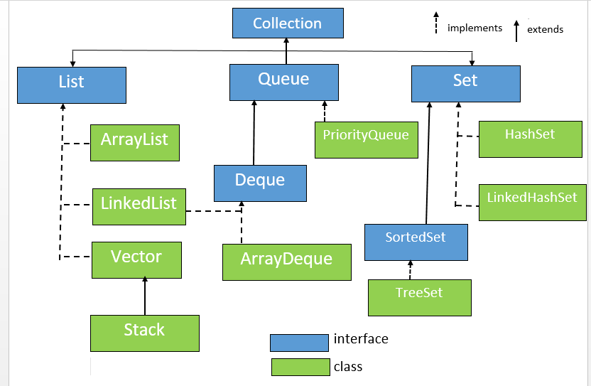

# cour : introduction au collections

## 1. Définiton du `collections` :

- Les collections sont des structures de données essentielles qui vous permettent de stocker, manipuler et organiser des ensembles d'objets de manière efficace. Java offre une riche bibliothèque de collections qui facilitent grandement la gestion des données dans vos programmes.

- Les collections en Java sont un ensemble de classes et d'interfaces qui fournissent des implémentations de diverses structures de données. Les collections vous permettent de manipuler des ensembles d'éléments de manière simple et efficace, en vous offrant des fonctionnalités pour ajouter, supprimer, rechercher et parcourir les éléments.

## 2. Les Types de Collections en Java :

Java propose différentes types de collections pour répondre à différents besoins. Voici quelques-uns des types de collections les plus couramment utilisés :

## 2.1 : **collections :**

### A.**Listes :** 
    
Une liste est une collection ordonnée d’éléments. Il existe différentes façons d’implémenter des listes dont les performances sont 
optimisées soit pour les accès aléatoires aux éléments soit pour les opérations d’insertion et de suppression d’éléments.

- #### La classe ``ArrayList``:

    * La classe `ArrayList` en Java est une implémentation de liste dynamique basée sur un tableau redimensionnable. Elle fait partie du 
    package `java.util` et offre une manière efficace de stocker et de manipuler des collections d'éléments. Contrairement aux tableaux 
    Java traditionnels, la taille d'un `ArrayList` peut être modifiée dynamiquement à mesure que des éléments sont ajoutés ou supprimés.

    * **Accès Rapide :** L'accès aux éléments d'un `ArrayList` par leur indice est rapide en temps constant (O(1)), car les éléments sont 
    stockés dans un tableau contigu en mémoire.

    * les opérations d'insertion et de suppression au milieu d'un `ArrayList` ont une complexité de O(n) .

    * `ArrayList` utilise un peu moins de mémoire que `LinkedList` en raison de l'absence de références supplémentaires pour les liens 
    entre les nœuds.

    * **Quand Utiliser ArrayList :**
        - Utilisez `ArrayList` lorsque vous avez principalement besoin d'accéder aux éléments par leur indice et que les opérations 
        d'insertion et de suppression ne sont pas fréquentes ou ne sont pas critiques en termes de performances. C'est particulièrement 
        utile lorsque vous connaissez approximativement la taille maximale de la liste à l'avance.

- #### la classe ``LinkedList`` :

    * La classe `LinkedList` en Java est une implémentation de la liste chaînée doublement liée. Elle fait partie du package `java.util` .

    * Chaque nœud dans une `LinkedList` contient une référence vers l'élément précédent et l'élément suivant. Cela permet un parcours 
    efficace dans les deux sens.

    * **Opérations d'Insertion et de Suppression Rapides :** `LinkedList` permet d'insérer et de supprimer des éléments en début, en fin ou 
    à n'importe quelle position de la liste en temps constant (O(1)).

    * **Quand Utiliser LinkedList :**
        - Utilisez `LinkedList` lorsque vous avez besoin d'effectuer fréquemment des opérations d'insertion ou de suppression en début, en 
        fin ou à l'intérieur de la liste. 

        - Cependant, si vous avez principalement besoin d'accéder aux éléments par leur indice et que vous n'avez pas besoin d'opérations 
        d'insertion et de suppression fréquentes, d'autres structures de données telles que `ArrayList` peuvent être plus appropriées.

- #### la classe ``Vector``:

    - La classe `java.util.Vector` et est utilisée pour stocker une liste dynamique d'éléments. Elle est similaire à `ArrayList`.
    -  Une des différences les plus importantes entre `Vector` et `ArrayList` est que `Vector` est synchronisé, ce qui signifie que les 
       opérations sur un `Vector` sont thread-safe
    - la classe `Vector` peut être moins performante que `ArrayList` dans un contexte où la synchronisation n'est pas nécessaire.

### B. **Ensembles (set) :** 

Les ensembles sont des collections qui ne contiennent pas de doublons. Ils sont utilisés pour stocker des éléments uniques. 

- #### la classe ``HashSet`` :

    * La classe `HashSet` en Java est une implémentation de l'interface `Set` qui stocke un ensemble d'éléments uniques dans une table de 
    hachage. 

    * Les opérations d'ajout, de suppression et de recherche d'éléments dans un `HashSet` ont généralement une complexité constante O(1).

    * Contrairement à `TreeSet`, les éléments dans un `HashSet` ne sont pas triés et ne sont pas stockés dans un ordre particulier.

    * **Quand Utiliser HashSet :**
        - Utilisez un `HashSet` lorsque vous avez besoin de stocker un ensemble d'éléments uniques et que l'ordre des éléments n'est pas 
         important. 

        - `HashSet` est efficace pour les opérations d'ajout, de suppression et de recherche, ce qui en fait un choix judicieux pour les    
        situations où les performances sont essentielles.

- #### la classe ``TreeSet`` :

    * La classe `TreeSet` en Java est une implémentation de l'interface `Set` qui maintient un ensemble trié d'éléments uniques. 

    * Les éléments dans un `TreeSet` sont stockés dans un arbre binaire de recherche équilibré (ARB), ce qui garantit un ordre naturel des 
      éléments tout en offrant une efficacité de recherche, d'insertion et de suppression.

    * Les éléments dans un `TreeSet` sont automatiquement triés dans l'ordre naturel (ordre défini par la comparaison naturelle des 
      éléments)

    *  les opérations de recherche, d'insertion et de suppression dans un `TreeSet` sont généralement log(n), où n est le nombre d'éléments 
    dans l'ensemble

    * **Quand Utiliser HashSet :**
        - Utilisez un ``TreeSet`` lorsque vous avez besoin d'un ensemble trié d'éléments uniques et que l'ordre des éléments est important. 

- #### la classe ``linkedHashSet`` :

    * La classe `LinkedHashSet` en Java est une autre implémentation de l'interface `Set`, similaire à `HashSet`, mais  garantit l'ordre 
    dans lequel les éléments ont été insérés. 

    * Les performances d'ajout, de suppression et de recherche d'éléments dans un `LinkedHashSet` sont similaires à celles d'un `HashSet`. 
    Ces opérations ont généralement une complexité constante O(1).

    * les éléments dans un `LinkedHashSet` sont stockés dans l'ordre dans lequel ils ont été insérés. Cela signifie que l'ordre d'insertion 
    est préservé lorsque vous parcourez l'ensemble

    * **Quand Utiliser LinkedHashSet :**
        - Utilisez un `LinkedHashSet` lorsque vous avez besoin de stocker un ensemble d'éléments uniques et que l'ordre d'insertion des 
        éléments est important. Si vous avez besoin d'une garantie sur l'ordre des éléments, mais que vous n'avez pas besoin d'un tri 
        naturel, `LinkedHashSet` est une option idéale.

### C. **Files d'Attente (Queue) :** 
Les files d'attente sont des collections pour lesquelles le premier élément ajouté est le premier à être retiré (FIFO - First-In-First-Out). 

- #### la classe ``PriorityQueue`` :

    * La classe `PriorityQueue` en Java est une implémentation de l'interface `Queue` qui maintient un ensemble d'éléments ordonnés en 
    fonction de leur priorité. 
    
    * Les éléments dans une `PriorityQueue` sont organisés de manière à ce que l'élément ayant la plus haute priorité soit toujours en tête 
    de la file.

    * L'élément ayant la plus haute priorité (ou la plus basse, selon la logique de comparaison) peut être récupéré rapidement en temps 
    constant (O(1)).

    * L'ajout (enfilage) et la suppression (défilage) d'éléments dans une `PriorityQueue` ont une complexité de temps de O(log n), où n est 
    le nombre d'éléments dans la file. Cette performance est rendue possible grâce à l'utilisation d'une structure de données appelée tas 
    binaire (binary heap).
    
    * Pas de Garantie d'Ordre Complet : la `PriorityQueue` ne garantit pas que les éléments suivants seront dans un ordre strictement 
    croissant ou décroissant. Les autres éléments peuvent être dans un ordre quelconque en fonction de la logique de comparaison.

    * **Quand Utiliser PriorityQueue :**
        - Utilisez une `PriorityQueue` lorsque vous avez besoin de maintenir un ensemble d'éléments ordonnés en fonction de leur priorité. 

## 2.2. **Cartes (Map) :** 

Les cartes sont des collections clé-valeur où chaque élément est associé à une clé unique. Les clés sont utilisées pour accéder rapidement aux valeurs. 

- #### la classe ``HashMap`` : 

    * La classe `HashMap` en Java est une implémentation de l'interface `Map` qui permet de stocker des paires clé-valeur. Elle fait partie 
    du package `java.util` et offre une manière efficace de stocker et de récupérer des valeurs en utilisant des clés associées. Les clés 
    dans une `HashMap` sont uniques, et chaque clé est associée à une valeur.

    *  **Efficacité de Recherche :** La recherche d'une valeur en fonction de sa clé est très rapide en temps constant (O(1)) en moyenne. 

    * **Pas d'Ordre :** `HashMap` ne garantit pas un ordre spécifique des clés ou des valeurs. Si vous avez besoin d'un ordre particulier, 
    vous pouvez utiliser `LinkedHashMap` (qui étend `HashMap`) pour préserver l'ordre d'insertion.

    * **Quand Utiliser HashMap :**

        * Utilisez `HashMap` lorsque vous avez besoin de stocker des données sous forme de paires clé-valeur et que l'ordre des éléments 
        n'est pas important.

        * Si vous avez besoin de maintenir un ordre d'insertion, vous pouvez envisager d'utiliser `LinkedHashMap`. Si vous avez besoin d'un 
        tri naturel des clés, vous pourriez considérer `TreeMap` (qui triera les clés par ordre naturel ou par un comparateur externe).

- #### la classe ``TreeMap`` :

    * La classe `TreeMap` en Java est une implémentation de l'interface `NavigableMap` qui stocke des paires clé-valeur, mais contrairement 
    à `HashMap`, les éléments dans une `TreeMap` sont automatiquement triés selon l'ordre des clés.

    * **Tri Automatique :** Les clés dans une `TreeMap` sont automatiquement triées. Vous pouvez spécifier un comparateur externe pour 
    personnaliser l'ordre de tri.

    * **Efficacité de Recherche :** La recherche, l'insertion et la suppression d'éléments dans une `TreeMap` ont généralement une complexité de temps de O(log n), où n est le nombre d'éléments dans la map. 

    * **Arbre Rouge-Noir :** La `TreeMap` utilise une structure d'arbre rouge-noir pour maintenir les clés triées et équilibrées. Cela 
    garantit des performances de recherche et de manipulation stables.

    * **Quand Utiliser TreeMap :**

        - Utilisez `TreeMap` lorsque vous avez besoin de stocker des données sous forme de paires clé-valeur et que vous avez besoin de les 
        maintenir automatiquement triées par leurs clés. 

- #### la classe ``LinkedHashMap`` :

    * La classe `LinkedHashMap` en Java est une implémentation de l'interface `Map` qui combine les caractéristiques de `HashMap` et 
    `LinkedHashSet`. Elle maintient les paires clé-valeur comme une `HashMap`, mais en plus, elle préserve l'ordre d'insertion des éléments 
    comme le ferait un `LinkedHashSet`. Cela signifie que vous pouvez parcourir les éléments dans l'ordre dans lequel ils ont été ajoutés à 
    la map.

    * **Paires Clé-Valeur et Ordre d'Insertion :** Comme une `HashMap`, `LinkedHashMap` stocke des paires clé-valeur. Cependant, 
    contrairement à `HashMap`, il préserve également l'ordre d'insertion des éléments.

    * **Efficacité de Recherche :** La recherche d'une valeur en fonction de sa clé dans une `LinkedHashMap` a une complexité de temps de   
    O(1) en moyenne, similaire à `HashMap`.

    * **Quand Utiliser LinkedHashMap :**

        - Utilisez `LinkedHashMap` lorsque vous avez besoin de stocker des données sous forme de paires clé-valeur et que l'ordre   
        d'insertion des éléments est important.
 

## 3. Les Méthodes de l'interface `collections` :

1. **`add(E e)` :** Cette méthode est utilisée pour ajouter un élément à la collection. Elle renvoie `true` si l'ajout réussit. Dans certains cas, lorsque l'ajout n'est pas autorisé (par exemple, si la collection est en lecture seule), elle peut lancer une exception.

2. **`addAll(Collection<? extends E> c)` :** Cette méthode ajoute tous les éléments d'une autre collection `c` à la collection actuelle. Elle renvoie `true` si la collection a été modifiée à la suite de l'ajout des éléments.

3. **`clear()` :** Cette méthode supprime tous les éléments de la collection, laissant la collection vide.

4. **`contains(Object o)` :** Cette méthode renvoie `true` si la collection contient l'élément spécifié `o`, sinon elle renvoie `false`.

5. **`isEmpty()` :** Cette méthode renvoie `true` si la collection est vide, c'est-à-dire si elle ne contient aucun élément.

6. **`remove(Object o)` :** Cette méthode supprime la première occurrence de l'élément spécifié `o` de la collection, s'il est présent. Si l'élément est supprimé, la méthode renvoie `true`, sinon elle renvoie `false`.

7. **`size()` :** Cette méthode renvoie le nombre d'éléments présents dans la collection.

Ces méthodes sont des éléments fondamentaux pour manipuler des collections en Java. Elles fournissent des opérations essentielles pour ajouter, retirer et vérifier la présence d'éléments, ainsi que pour gérer la taille et la clarté des collections.

## 4. Resume en tableau : 

Quelques spécificités des classes de collections pour manipuler vos données.

|NOM|ORDONNÉE|DOUBLONS|ACCÈS DIRECT|VALEURS NULLES|THREAD-SAFE|
|:--:|:--:|:--:|:--:|:--:|:--:|
|**ArrayDeque**|✔|✔|❌|❌|❌|
|**ArrayList**|✔|✔|✔|✔|❌|
|**HashMap**|❌|❌|✔|✔|❌|
|**HashSet**|❌|❌|❌|✔|❌|
|**LinkedList**|✔|✔|❌|✔|❌|
|**PriorityQueue**|✔|✔|❌|❌|❌|
|**Stack**|✔|✔|❌|✔|✔|
|**TreeMap**|✔|❌|✔|❌|❌|
|**TreeSet**|✔|❌|❌|❌|❌|
|**Vector**|✔|✔|✔|✔|✔|

## 5. Compléxite :

Cheat-sheet des coûts associés aux principales collections
----------------------------------------------------------

Voici un tableau récapitulatif des coûts associés aux opérations sur les collections présentées dans cette fiche :

| Interface List                 | Add    | Remove   | Get    | Contains   | Next   | Data Structure
| :------------------------------|:------:|:--------:|:------:|:----------:|:------:|---------------:
| ArrayList                      | O(1)   |  O(n)    | O(1)   |   O(n)     | O(1)   | Array
| LinkedList                     | O(1)   |  O(1)    | O(n)   |   O(n)     | O(1)   | Doubly Linked List

| Interface Set                    |    Add   |  Remove  | Contains |   Next   | Size | Data Structure
| :--------------------------------|:--------:|:--------:|:--------:|:--------:|:----:|---------------:
| HashSet                          | O(1)     | O(1)     | O(1)     | O(h/n)   | O(1) | Hash Table
| TreeSet                          | O(log n) | O(log n) | O(log n) | O(log n) | O(1) | Red-black tree

| Interface Queue                   |  Offer   | Peak |   Poll   | Remove | Size | Data Structure
| :---------------------------------|:--------:|:----:|:--------:|:------:|:----:|---------------:
| PriorityQueue                     | O(log n) | O(1) | O(log n) |  O(n)  | O(1) | Priority Heap
| LinkedList                        | O(1)     | O(1) | O(1)     |  O(1)  | O(1) | Doubly Linked List
| ArrayDequeue                      | O(1)     | O(1) | O(1)     |  O(n)  | O(1) | Array

| Interface Map                   |   Get    | ContainsKey |   Next   | Data Structure
| :-------------------------------|:--------:|:-----------:|:--------:|---------------:
| HashMap                         | O(1)     |   O(1)      | O(h / n) | Hash Table
| TreeMap                         | O(log n) |   O(log n)  | O(log n) | Red-black tree