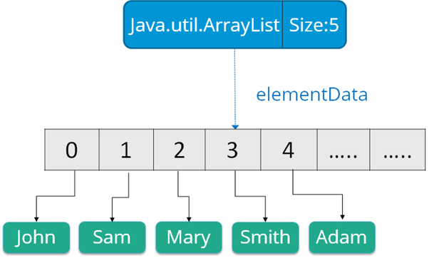
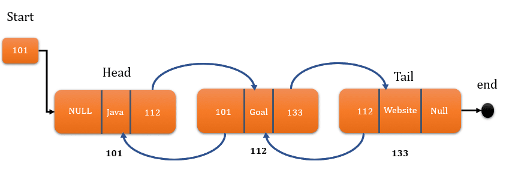

# cour : Les Listes 


## I. ``ArrayList`` :


### 1.Défintion et Caractéristiques :

* La classe `ArrayList` en Java est une implémentation de liste dynamique basée sur un tableau redimensionnable. Elle fait partie du 
package `java.util` et offre une manière efficace de stocker et de manipuler des collections d'éléments. Contrairement aux tableaux 
Java traditionnels, la taille d'un `ArrayList` peut être modifiée dynamiquement à mesure que des éléments sont ajoutés ou supprimés.

* **Accès Rapide :** L'accès aux éléments d'un `ArrayList` par leur indice est rapide en temps constant (O(1)), car les éléments sont 
stockés dans un tableau contigu en mémoire.

* les opérations d'insertion et de suppression au milieu d'un `ArrayList` ont une complexité de O(n) .

* `ArrayList` utilise un peu moins de mémoire que `LinkedList` en raison de l'absence de références supplémentaires pour les liens 

entre les nœuds.

* **Quand Utiliser ArrayList :**
        - Utilisez `ArrayList` lorsque vous avez principalement besoin d'accéder aux éléments par leur indice et que les opérations 
        d'insertion et de suppression ne sont pas fréquentes ou ne sont pas critiques en termes de performances. C'est particulièrement 
        utile lorsque vous connaissez approximativement la taille maximale de la liste à l'avance.

### 2. Les Méthodes : 

**Méthodes Principales d'ArrayList :**

1. **`add(E e)` :** Ajoute un élément à la fin de la liste.

```java
ArrayList<String> liste = new ArrayList<>();
liste.add("Premier");
liste.add("Deuxième");
```

2. **`get(int index)` :** Récupère l'élément à l'indice spécifié.

```java
String deuxiemeElement = liste.get(1); // Récupère "Deuxième"
```

3. **`set(int index, E element)` :** Remplace l'élément à l'indice spécifié par le nouvel élément.

```java
liste.set(1, "Nouveau Deuxième");
```

4. **`remove(int index)` :** Supprime l'élément à l'indice spécifié.

```java
liste.remove(0); // Supprime le premier élément
```

5. **`size()` :** Renvoie le nombre d'éléments dans la liste.

```java
int taille = liste.size(); // Taille actuelle de la liste
```

6. **`isEmpty()` :** Vérifie si la liste est vide.

```java
boolean estVide = liste.isEmpty(); // Renvoie true si la liste est vide
```

7. **`clear()` :** Supprime tous les éléments de la liste, laissant la liste vide.

```java
liste.clear(); // La liste est maintenant vide
```

8. **`contains(Object o)` :** Vérifie si la liste contient l'élément spécifié.

```java
boolean contientElement = liste.contains("Deuxième"); // Renvoie true si "Deuxième" est dans la liste
```

9. **`addAll(Collection<? extends E> c)` :** Ajoute tous les éléments d'une autre collection à la fin de la liste.

```java
ArrayList<String> autreListe = new ArrayList<>();
autreListe.add("Troisième");
autreListe.add("Quatrième");
liste.addAll(autreListe); // Maintenant, "Troisième" et "Quatrième" sont dans la liste
```

### 3. parcourir une ``ArrayList`` : 

Voici trois façons courantes de parcourir un `ArrayList` en Java : en utilisant une boucle `for`, une boucle "foreach" et la méthode `Iterator`.

1. Boucle `for` traditionnelle :
```java
import java.util.ArrayList;

public class Main {
    public static void main(String[] args) {
        ArrayList<String> fruits = new ArrayList<>();
        fruits.add("Pomme");
        fruits.add("Banane");
        fruits.add("Orange");

        for (int i = 0; i < fruits.size(); i++) {
            String fruit = fruits.get(i);
            System.out.println(fruit);
        }
    }
}
```

2. Boucle "foreach" (boucle améliorée) :
```java
import java.util.ArrayList;

public class Main {
    public static void main(String[] args) {
        ArrayList<String> fruits = new ArrayList<>();
        fruits.add("Pomme");
        fruits.add("Banane");
        fruits.add("Orange");

        for (String fruit : fruits) {
            System.out.println(fruit);
        }
    }
}
```

3. Utilisation de l'interface `Iterator` :
```java
import java.util.ArrayList;
import java.util.Iterator;

public class Main {
    public static void main(String[] args) {
        ArrayList<String> fruits = new ArrayList<>();
        fruits.add("Pomme");
        fruits.add("Banane");
        fruits.add("Orange");

        Iterator<String> iterator = fruits.iterator();
        while (iterator.hasNext()) {
            String fruit = iterator.next();
            System.out.println(fruit);
        }
    }
}
```

### 4. Trie les élmentrs d'une ``ArrayList`` :

Pour trier les éléments d'une `ArrayList` en Java, vous pouvez utiliser la méthode `sort` de la classe `Collections`. 

Exemple :

```java
import java.util.ArrayList;
import java.util.Collections;

public class Main {
    public static void main(String[] args) {
        ArrayList<Integer> numbers = new ArrayList<>();
        numbers.add(5);
        numbers.add(2);
        numbers.add(8);
        numbers.add(1);

        Collections.sort(numbers);

        for (Integer number : numbers) {
            System.out.println(number);
        }
    }
}
```


## II. ``linkedList`` :



### 1.Définition et Carctéristiques :


* La classe `LinkedList` en Java est une implémentation de la liste chaînée doublement liée. Elle fait partie du package `java.util` .

* Chaque nœud dans une `LinkedList` contient une référence vers l'élément précédent et l'élément suivant. Cela permet un parcours 
efficace dans les deux sens.

* **Opérations d'Insertion et de Suppression Rapides :** `LinkedList` permet d'insérer et de supprimer des éléments en début, en fin ou 
    à n'importe quelle position de la liste en temps constant (O(1)).

* **Quand Utiliser LinkedList :** 
- Utilisez `LinkedList` lorsque vous avez besoin d'effectuer fréquemment des opérations d'insertion ou de suppression en début, en 
        fin ou à l'intérieur de la liste. 

- Cependant, si vous avez principalement besoin d'accéder aux éléments par leur indice et que vous n'avez pas besoin d'opérations 
        d'insertion et de suppression fréquentes, d'autres structures de données telles que `ArrayList` peuvent être plus appropriées.

### 2. Les Méthodes 

Voici quelques méthodes couramment utilisées de la classe `LinkedList` avec des exemples :

#### 2.1 : L'Ajout des élements 

a. **Ajouter des éléments au début de la liste (`addFirst`) :**
```java
import java.util.LinkedList;

public class Main {
    public static void main(String[] args) {
        LinkedList<String> linkedList = new LinkedList<>();
        
        linkedList.addFirst("Troisième");
        linkedList.addFirst("Deuxième");
        linkedList.addFirst("Premier");
        
        System.out.println(linkedList); // Affiche: [Premier, Deuxième, Troisième]
    }
}
```
 
b. **Ajouter des éléments à la fin de la liste (`addLast`) :**
```java
import java.util.LinkedList;

public class Main {
    public static void main(String[] args) {
        LinkedList<String> linkedList = new LinkedList<>();
        
        linkedList.addLast("Premier");
        linkedList.addLast("Deuxième");
        linkedList.addLast("Troisième");
        
        System.out.println(linkedList); // Affiche: [Premier, Deuxième, Troisième]
    }
}
```

#### 2.2 : Supprimer des élements :

a. **Supprimer et renvoyer le premier élément (`removeFirst`) :**
```java
import java.util.LinkedList;

public class Main {
    public static void main(String[] args) {
        LinkedList<String> linkedList = new LinkedList<>();
        linkedList.add("Premier");
        linkedList.add("Deuxième");
        linkedList.add("Troisième");
        
        String firstElement = linkedList.removeFirst();
        
        System.out.println(firstElement); // Affiche: Premier
        System.out.println(linkedList);   // Affiche: [Deuxième, Troisième]
    }
}
```

#### 2.3 Obtenir le premier et le dernier élément sans les supprimer :(`getFirst`, `getLast`)

Exemple :

```java
import java.util.LinkedList;

public class Main {
    public static void main(String[] args) {
        LinkedList<String> linkedList = new LinkedList<>();
        linkedList.add("Premier");
        linkedList.add("Deuxième");
        linkedList.add("Troisième");
        
        String firstElement = linkedList.getFirst();
        String lastElement = linkedList.getLast();
        
        System.out.println(firstElement); // Affiche: Premier
        System.out.println(lastElement);  // Affiche: Troisième
    }
}
```

                                                                                                                                                                                                                                                                                                                                                                                                                              

### 3. Parcourir les élemnts d'une ``LinkedList`` :

Exemple :

```java
import java.util.LinkedList;
import java.util.Iterator;

public class Main {
    public static void main(String[] args) {
        LinkedList<String> linkedList = new LinkedList<>();
        linkedList.add("Premier");
        linkedList.add("Deuxième");
        linkedList.add("Troisième");
        
        for (String element : linkedList) {
            System.out.println(element);
        }
        
        Iterator<String> iterator = linkedList.iterator();
        while (iterator.hasNext()) {
            System.out.println(iterator.next());
        }
    }
}
```


## III. ``Vector`` : 

la classe `Vector` est similaire à la classe `ArrayList` en Java en ce sens qu'elles sont toutes les deux utilisées pour stocker et gérer des collections d'objets de manière dynamique. Cependant, il y a quelques différences entre les deux classes.

Voici quelques similitudes et différences clés entre `Vector` et `ArrayList` :

**Similitudes :**
1. **Structure de données dynamique :** Les deux classes permettent de stocker un nombre variable d'éléments et ajustent automatiquement leur capacité interne en fonction des besoins.

2. **Accès direct aux éléments :** Vous pouvez accéder directement aux éléments en utilisant un index.

3. **Méthodes similaires :** Les méthodes pour ajouter, supprimer et parcourir les éléments sont similaires entre `Vector` et `ArrayList`.

**Différences :**
1. **Synchronisation :** C'est l'une des principales différences. La classe `Vector` est thread-safe par défaut, ce qui signifie que les opérations sur un `Vector` sont synchronisées et peuvent être utilisées dans un environnement multithread sans problème majeur de concurrence. En revanche, `ArrayList` n'est pas synchronisé par défaut, ce qui signifie que si vous devez l'utiliser dans un environnement multithread, vous devez prendre des mesures pour synchroniser les opérations manuellement.

2. **Performance :** En raison de la synchronisation intégrée, les opérations sur `Vector` peuvent être plus lentes que celles sur `ArrayList` dans un environnement où la synchronisation n'est pas nécessaire. `ArrayList` est souvent plus rapide dans un contexte non thread-safe.

En conclusion, si vous travaillez dans un environnement multithread et que la synchronisation est une préoccupation, `Vector` peut être préférable. Cependant, dans la plupart des cas, `ArrayList` est utilisé car il offre de meilleures performances dans des environnements non thread-safe et est plus largement utilisé dans les applications modernes.

## IV. ``Stack`` :


### 1. définiton et caractéristiques :

- La classe `Stack` en Java est une implémentation d'une pile, qui est une structure de données linéaire basée sur le principe LIFO (Last In, First Out). Cela signifie que le dernier élément ajouté à la pile est le premier élément à en sortir. La classe `Stack` est une sous-classe de la classe `Vector`, ce qui signifie qu'elle hérite de ses fonctionnalités et méthodes.


### 2. Les Méthodes : 

- `push` est utilisé pour ajouter des éléments à la pile, 
- `pop` est utilisé pour retirer et renvoyer l'élément au sommet de la pile.
- `peek` est utilisé pour accéder à l'élément au sommet sans le retirer. 

```java
import java.util.Stack;

public class Main {
    public static void main(String[] args) {
        Stack<String> stack = new Stack<>();
        
        stack.push("Premier");
        stack.push("Deuxième");
        stack.push("Troisième");
        
        System.out.println("Éléments de la pile : " + stack);
        
        String topElement = stack.pop();
        System.out.println("Élément retiré de la pile : " + topElement);
        
        System.out.println("Éléments restants dans la pile : " + stack);
        
        String peekElement = stack.peek();
        System.out.println("Sommet de la pile (sans retirer) : " + peekElement);
    }
}
```

