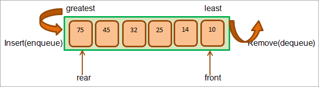
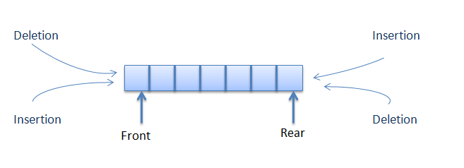

# cour : Queue && Deque 


## I. PriortyQueue :



### 1.Définition et Caractéristiques : 

- #### la classe ``PriorityQueue`` :

    * La classe `PriorityQueue` en Java est une implémentation de file de priorité basée sur un tas binaire.

    * La classe `PriorityQueue` en Java est une implémentation de l'interface `Queue` qui maintient un ensemble d'éléments ordonnés en 
    fonction de leur priorité. 
    
    * Les éléments dans une `PriorityQueue` sont organisés de manière à ce que l'élément ayant la plus haute priorité soit toujours en tête 
    de la file.

    * L'élément ayant la plus haute priorité (ou la plus basse, selon la logique de comparaison) peut être récupéré rapidement en temps 
    constant (O(1)).

    * L'ajout (enfilage) et la suppression (défilage) d'éléments dans une `PriorityQueue` ont une complexité de temps de O(log n), où n est 
    le nombre d'éléments dans la file. Cette performance est rendue possible grâce à l'utilisation d'une structure de données appelée tas 
    binaire (binary heap).
    
    * Pas de Garantie d'Ordre Complet : la `PriorityQueue` ne garantit pas que les éléments suivants seront dans un ordre strictement 
    croissant ou décroissant. Les autres éléments peuvent être dans un ordre quelconque en fonction de la logique de comparaison.

    * **Quand Utiliser PriorityQueue :**
        - Utilisez une `PriorityQueue` lorsque vous avez besoin de maintenir un ensemble d'éléments ordonnés en fonction de leur priorité. 


Exemple :

Voici comment utiliser la classe `PriorityQueue` en Java :

```java
import java.util.PriorityQueue;

public class Main {
    public static void main(String[] args) {
        // Création d'une file de priorité d'entiers
        PriorityQueue<Integer> priorityQueue = new PriorityQueue<>();

        // Ajout d'éléments à la file de priorité
        priorityQueue.add(10);
        priorityQueue.add(5);
        priorityQueue.add(15);

        // Retrait des éléments avec la plus haute priorité
        while (!priorityQueue.isEmpty()) {
            int highestPriority = priorityQueue.poll();
            System.out.println("Élément de priorité la plus élevée : " + highestPriority);
        }
    }
}
```

#### RQ :

- Lorsque vous utilisez le type `Integer` (ou tout autre type non personnalisé) avec la classe `PriorityQueue` en Java, les éléments doivent implémenter l'interface `Comparable` ou être fournis avec un comparateur externe pour déterminer l'ordre de priorité.

- L'interface `Comparable` a une méthode `compareTo` qui doit être implémentée pour permettre à la file de priorité de comparer les éléments et de les organiser en fonction de leur priorité. Par défaut, les éléments seront ordonnés dans l'ordre naturel, du plus petit au plus grand.


### 2. Les Méthodes : 


1. **`add(E element)` :** Ajoute un élément à la file de priorité.

```java
import java.util.PriorityQueue;

public class Main {
    public static void main(String[] args) {
        PriorityQueue<Integer> pq = new PriorityQueue<>();
        pq.add(10);
        pq.add(5);
        pq.add(15);
        
        System.out.println(pq); // Affiche : [5, 10, 15]
    }
}
```

2. **`poll()` :** Renvoie et supprime l'élément de priorité la plus élevée.

```java
import java.util.PriorityQueue;

public class Main {
    public static void main(String[] args) {
        PriorityQueue<Integer> pq = new PriorityQueue<>();
        pq.add(10);
        pq.add(5);
        pq.add(15);
        
        Integer highestPriority = pq.poll();
        
        System.out.println("Élément de priorité la plus élevée : " + highestPriority); // Affiche : 5
        System.out.println(pq); // Affiche : [10, 15]
    }
}
```

3. **`peek()` :** Renvoie l'élément de priorité la plus élevée sans le supprimer.

```java
import java.util.PriorityQueue;

public class Main {
    public static void main(String[] args) {
        PriorityQueue<Integer> pq = new PriorityQueue<>();
        pq.add(10);
        pq.add(5);
        pq.add(15);
        
        Integer highestPriority = pq.peek();
        
        System.out.println("Élément de priorité la plus élevée : " + highestPriority); // Affiche : 5
        System.out.println(pq); // Affiche : [5, 10, 15]
    }
}
```

4. **`size()` :** Renvoie le nombre d'éléments dans la file de priorité.

```java
import java.util.PriorityQueue;

public class Main {
    public static void main(String[] args) {
        PriorityQueue<Integer> pq = new PriorityQueue<>();
        pq.add(10);
        pq.add(5);
        pq.add(15);
        
        int size = pq.size();
        
        System.out.println("Nombre d'éléments : " + size); // Affiche : 3
    }
}
```

5. **`isEmpty()` :** Vérifie si la file de priorité est vide.

```java
import java.util.PriorityQueue;

public class Main {
    public static void main(String[] args) {
        PriorityQueue<Integer> pq = new PriorityQueue<>();
        
        boolean isEmpty = pq.isEmpty();
        
        System.out.println("La file de priorité est vide : " + isEmpty); // Affiche : true
    }
}
```


### 3.  Parcourir un `PriorityQueue` : 

Pour parcourir un `PriorityQueue` en Java, vous pouvez utiliser un itérateur ou en utilisant la méthode `poll()` pour retirer les éléments un par un jusqu'à ce que la file de priorité soit vide. Voici comment faire :

1. **Utilisation d'un itérateur :**
```java
import java.util.PriorityQueue;
import java.util.Iterator;

public class Main {
    public static void main(String[] args) {
        PriorityQueue<Integer> priorityQueue = new PriorityQueue<>();
        priorityQueue.add(10);
        priorityQueue.add(5);
        priorityQueue.add(15);

        Iterator<Integer> iterator = priorityQueue.iterator();
        while (iterator.hasNext()) {
            Integer element = iterator.next();
            System.out.println("Élément : " + element);
        }
    }
}
```

2. **Utilisation de `poll()` pour parcourir et vider la file de priorité :**
```java
import java.util.PriorityQueue;

public class Main {
    public static void main(String[] args) {
        PriorityQueue<Integer> priorityQueue = new PriorityQueue<>();
        priorityQueue.add(10);
        priorityQueue.add(5);
        priorityQueue.add(15);

        while (!priorityQueue.isEmpty()) {
            Integer element = priorityQueue.poll();
            System.out.println("Élément : " + element);
        }
    }
}
```

## II. ArrayDeque : 


### 1.Défintion et Caractéristiques :

-  La classe `ArrayDeque` en Java est une implémentation de file double-ended (deque) basée sur un tableau dynamique. 

- Un deque est une structure de données qui permet l'ajout et la suppression d'éléments à la fois au début et à la fin de la file. Contrairement à `Stack` et `Queue`, `ArrayDeque` n'impose pas de restriction stricte sur l'ordre de retrait des éléments.

- La classe `ArrayDeque` est très polyvalente et peut être utilisée pour implémenter à la fois des piles (utilisation de méthodes `push` et `pop`) et des files (utilisation de méthodes `offer` et `poll`). De plus, elle est plus performante que `LinkedList` pour la plupart des cas d'utilisation, car elle est implémentée sous forme de tableau dynamique.
 


Exemple :

```java
import java.util.ArrayDeque;

public class Main {
    public static void main(String[] args) {
        // Création d'une file double-ended (deque) d'entiers
        ArrayDeque<Integer> arrayDeque = new ArrayDeque<>();

        // Ajout d'éléments au début et à la fin
        arrayDeque.addFirst(10);
        arrayDeque.addLast(20);
        arrayDeque.addFirst(5);
        arrayDeque.addLast(15);

        // Retrait des éléments
        while (!arrayDeque.isEmpty()) {
            Integer element = arrayDeque.pollFirst();
            System.out.println("Élément retiré : " + element);
        }
    }
}
```


### 2. Les Méthodes : 

La classe `ArrayDeque` en Java offre un ensemble de méthodes pour manipuler une file double-ended (deque) basée sur un tableau dynamique. 


1. **`addFirst(E element)` :** Ajoute un élément au début de la deque.

2. **`addLast(E element)` :** Ajoute un élément à la fin de la deque.

3. **`offerFirst(E element)` :** Fonctionne de la même manière que `addFirst()`.

4. **`offerLast(E element)` :** Fonctionne de la même manière que `addLast()`.

5. **`removeFirst()` :** Supprime et renvoie l'élément du début de la deque.

6. **`removeLast()` :** Supprime et renvoie l'élément de la fin de la deque.

7. **`pollFirst()` :** Renvoie et supprime l'élément du début de la deque.

8. **`pollLast()` :** Renvoie et supprime l'élément de la fin de la deque.

9. **`getFirst()` :** Renvoie l'élément du début de la deque sans le supprimer.

10. **`getLast()` :** Renvoie l'élément de la fin de la deque sans le supprimer.

11. **`peekFirst()` :** Renvoie l'élément du début de la deque sans le supprimer (retourne `null` si la deque est vide).

12. **`peekLast()` :** Renvoie l'élément de la fin de la deque sans le supprimer (retourne `null` si la deque est vide).

13. **`size()` :** Renvoie le nombre d'éléments dans la deque.

14. **`isEmpty()` :** Vérifie si la deque est vide.

15. **`clear()` :** Supprime tous les éléments de la deque.

16. **`toArray()` :** Renvoie un tableau contenant tous les éléments de la deque.


#### Exemple Complet : 

```java 

import java.util.ArrayDeque;

public class Main {
    public static void main(String[] args) {
        // Création d'une file double-ended (deque) d'entiers
        ArrayDeque<Integer> arrayDeque = new ArrayDeque<>();

        // Ajout d'éléments au début et à la fin
        arrayDeque.addFirst(10);
        arrayDeque.addLast(20);
        arrayDeque.addFirst(5);
        arrayDeque.addLast(15);

        // Utilisation de addFirst() et addLast()
        System.out.println("Deque après l'ajout : " + arrayDeque);

        // Utilisation de removeFirst() et removeLast()
        arrayDeque.removeFirst();
        arrayDeque.removeLast();
        System.out.println("Deque après la suppression : " + arrayDeque);

        // Utilisation de pollFirst() et pollLast()
        Integer polledFirst = arrayDeque.pollFirst();
        Integer polledLast = arrayDeque.pollLast();
        System.out.println("Élément du début supprimé : " + polledFirst);
        System.out.println("Élément de la fin supprimé : " + polledLast);

        // Utilisation de getFirst() et getLast() pour accéder aux éléments sans les supprimer
        Integer first = arrayDeque.getFirst();
        Integer last = arrayDeque.getLast();
        System.out.println("Premier élément : " + first);
        System.out.println("Dernier élément : " + last);

        // Utilisation de peekFirst() et peekLast() pour accéder aux éléments sans les supprimer
        Integer peekedFirst = arrayDeque.peekFirst();
        Integer peekedLast = arrayDeque.peekLast();
        System.out.println("Premier élément (peek) : " + peekedFirst);
        System.out.println("Dernier élément (peek) : " + peekedLast);

        // Utilisation de size() et isEmpty()
        System.out.println("Taille de la deque : " + arrayDeque.size());
        System.out.println("La deque est vide : " + arrayDeque.isEmpty());
    }
}


```

17. `removeLastOccurrence()`: Cette méthode permet de supprimer la dernière occurrence d'un élément spécifique dans la deque.

Exemple :

```java
import java.util.ArrayDeque;

public class Main {
    public static void main(String[] args) {
        ArrayDeque<Integer> arrayDeque = new ArrayDeque<>();
        arrayDeque.add(10);
        arrayDeque.add(20);
        arrayDeque.add(30);
        arrayDeque.add(20);

        System.out.println("Avant suppression : " + arrayDeque);

        // Suppression de la dernière occurrence de 20
        boolean removed = arrayDeque.removeLastOccurrence(20);

        System.out.println("Après suppression : " + arrayDeque);
        System.out.println("Dernière occurrence de 20 supprimée : " + removed);
    }
}
```


#### RQ : la diifernce entre `addFirst()` et `offerFirst` 

La différence entre les méthodes `addFirst()` et `offerFirst()` réside principalement dans leur comportement lorsque la deque est pleine (dans le cas très rare où la capacité de la deque serait limitée).

1. **`addFirst(E element)` :** Cette méthode ajoute l'élément spécifié au début de la deque. Si la deque est pleine et ne peut pas accueillir plus d'éléments, cette méthode lèvera une exception `IllegalStateException`.

2. **`offerFirst(E element)` :** Cette méthode ajoute l'élément spécifié au début de la deque. Si la deque est pleine et ne peut pas accueillir plus d'éléments, cette méthode renverra simplement `false`, indiquant que l'ajout a échoué.


### 3. Parcourir une `ArrayDeque` :


3.1. **Utilisation d'un itérateur :**
```java
import java.util.ArrayDeque;
import java.util.Iterator;

public class Main {
    public static void main(String[] args) {
        ArrayDeque<Integer> arrayDeque = new ArrayDeque<>();
        arrayDeque.add(10);
        arrayDeque.add(20);
        arrayDeque.add(30);

        Iterator<Integer> iterator = arrayDeque.iterator();
        while (iterator.hasNext()) {
            Integer element = iterator.next();
            System.out.println("Élément : " + element);
        }
    }
}
```

2. **Utilisation d'une boucle `for-each` :**
```java
import java.util.ArrayDeque;

public class Main {
    public static void main(String[] args) {
        ArrayDeque<Integer> arrayDeque = new ArrayDeque<>();
        arrayDeque.add(10);
        arrayDeque.add(20);
        arrayDeque.add(30);

        for (Integer element : arrayDeque) {
            System.out.println("Élément : " + element);
        }
    }
}
```

Dans ces exemples, nous parcourons la `ArrayDeque` en utilisant à la fois un itérateur et une boucle `for-each`. Chaque élément est extrait de la deque et affiché. Notez que l'ordre d'itération suivra l'ordre dans lequel les éléments ont été ajoutés.


### 4. Pile et File :

Vous pouvez implémenter à la fois une pile (stack) et une file (queue) en utilisant la classe `ArrayDeque` en Java. 

**4.1 Implémentation d'une Pile (Stack) avec `ArrayDeque` :**

Pour implémenter une pile, vous pouvez utiliser les méthodes `push()` pour ajouter un élément au sommet de la pile et `pop()` pour retirer et renvoyer l'élément du sommet de la pile.

```java
import java.util.ArrayDeque;

public class StackExample {
    public static void main(String[] args) {
        ArrayDeque<Integer> stack = new ArrayDeque<>();

        stack.push(10);
        stack.push(20);
        stack.push(30);

        System.out.println("Sommet de la pile : " + stack.peek()); // Affiche 30
        
        while (!stack.isEmpty()) {
            System.out.println("Élément retiré de la pile : " + stack.pop());
        }
    }
}
```

**4.2 Implémentation d'une File (Queue) avec `ArrayDeque` :**

Pour implémenter une file, vous pouvez utiliser les méthodes `offer()` pour ajouter un élément à la fin de la file et `poll()` pour retirer et renvoyer l'élément du début de la file.

```java
import java.util.ArrayDeque;

public class QueueExample {
    public static void main(String[] args) {
        ArrayDeque<Integer> queue = new ArrayDeque<>();

        queue.offer(10);
        queue.offer(20);
        queue.offer(30);

        System.out.println("Élément en tête de la file : " + queue.peek()); // Affiche 10
        
        while (!queue.isEmpty()) {
            System.out.println("Élément retiré de la file : " + queue.poll());
        }
    }
}
```

