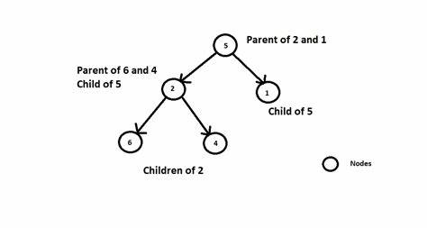

# cour : Set 


## I. `HashSet` :

### 1. Définition et Caractéristiques : 


* La classe `HashSet` en Java est une implémentation de l'interface `Set` qui stocke un ensemble d'éléments uniques dans une table de 
hachage. 

* Pas de doublons , pas thread-safe . 

* Les opérations d'ajout, de suppression et de recherche d'éléments dans un `HashSet` ont généralement une complexité constante O(1).

* Contrairement à `TreeSet`, les éléments dans un `HashSet` ne sont pas triés et ne sont pas stockés dans un ordre particulier.


* **Quand Utiliser HashSet :**
    - Utilisez un `HashSet` lorsque vous avez besoin de stocker un ensemble d'éléments uniques et que l'ordre des éléments n'est pas 
         important. 

    - `HashSet` est efficace pour les opérations d'ajout, de suppression et de recherche, ce qui en fait un choix judicieux pour les    
        situations où les performances sont essentielles.


### 2. Les Méthodes : 


1. **add(E e)** : Ajoute un élément à l'ensemble si cet élément n'est pas déjà présent.

```java
HashSet<String> set = new HashSet<>();
set.add("apple");
set.add("banana");
set.add("orange");
```

2. **remove(Object o)** : Supprime l'élément spécifié de l'ensemble.

```java
set.remove("banana");
```

3. **contains(Object o)** : Vérifie si l'ensemble contient l'élément spécifié.

```java
boolean containsOrange = set.contains("orange"); // Renvoie true
boolean containsGrapes = set.contains("grapes"); // Renvoie false
```

4. **size()** : Renvoie le nombre d'éléments dans l'ensemble.

```java
int size = set.size(); // Renvoie 2
```

5. **isEmpty()** : Vérifie si l'ensemble est vide.

```java
boolean isEmpty = set.isEmpty(); // Renvoie false
```

6. **clear()** : Supprime tous les éléments de l'ensemble.

```java
set.clear();
```

7. **iterator()** : Renvoie un itérateur sur les éléments de l'ensemble.

```java
Iterator<String> iterator = set.iterator();
while (iterator.hasNext()) {
    String element = iterator.next();
    System.out.println(element);
}
```

8. **addAll(Collection<? extends E> c)** : Ajoute tous les éléments de la collection spécifiée à l'ensemble.

```java
ArrayList<String> fruits = new ArrayList<>();
fruits.add("apple");
fruits.add("grapes");
set.addAll(fruits);
```

9. **retainAll(Collection<?> c)** : Supprime de l'ensemble tous les éléments qui ne sont pas contenus dans la collection spécifiée.

```java
HashSet<String> fruitsToRemove = new HashSet<>();
fruitsToRemove.add("apple");
set.retainAll(fruitsToRemove);
```

10. **removeAll(Collection<?> c)** : Supprime de l'ensemble tous les éléments présents dans la collection spécifiée.

```java
ArrayList<String> fruitsToRemove = new ArrayList<>();
fruitsToRemove.add("apple");
fruitsToRemove.add("grapes");
set.removeAll(fruitsToRemove);
```


### RQ : 

Pour que la classe `HashSet` (et d'autres structures de données basées sur le hachage) fonctionne correctement, les objets que vous insérez doivent respecter les contrats de `hashCode()` et `equals()`. Voici pourquoi :

1. **hashCode()** : Cette méthode renvoie un code de hachage (entier) représentant l'objet. Les codes de hachage sont utilisés pour accélérer la recherche dans des structures de données comme les tables de hachage. Si deux objets sont égaux selon la méthode `equals()`, leur méthode `hashCode()` doit renvoyer la même valeur.

2. **equals()** : Cette méthode compare si deux objets sont égaux. Si deux objets sont égaux, leur méthode `equals()` doit renvoyer `true`. Cela implique également que si `equals()` renvoie `true` pour deux objets, alors leurs codes de hachage doivent être égaux.

Voici un exemple de classe avec une implémentation correcte de `hashCode()` et `equals()` :

```java
public class Person {
    private String firstName;
    private String lastName;
    
    public Person(String firstName, String lastName) {
        this.firstName = firstName;
        this.lastName = lastName;
    }
    
    @Override
    public int hashCode() {
        return Objects.hash(firstName, lastName);
    }
    
    @Override
    public boolean equals(Object obj) {
        if (this == obj) return true;
        if (obj == null || getClass() != obj.getClass()) return false;
        
        Person person = (Person) obj;
        return Objects.equals(firstName, person.firstName) &&
               Objects.equals(lastName, person.lastName);
    }
}
```

Dans cet exemple, la méthode `hashCode()` combine les codes de hachage des champs `firstName` et `lastName`. La méthode `equals()` compare les champs `firstName` et `lastName` pour déterminer l'égalité entre deux objets `Person`.


## II. `TreeSet` :





### 1.Définition et Caractéristiques : 

* La classe `TreeSet` en Java est une implémentation de l'interface `Set` qui maintient un ensemble trié d'éléments uniques. 

* Les éléments dans un `TreeSet` sont stockés dans un arbre binaire de recherche équilibré (ARB), ce qui garantit un ordre naturel des 
éléments tout en offrant une efficacité de recherche, d'insertion et de suppression.

* Les éléments dans un `TreeSet` sont automatiquement triés dans l'ordre naturel (ordre défini par la comparaison naturelle des 
éléments)

*  les opérations de recherche, d'insertion et de suppression dans un `TreeSet` sont généralement log(n), où n est le nombre d'éléments 
dans l'ensemble

* **Quand Utiliser HashSet :**
    
    - Utilisez un ``TreeSet`` lorsque vous avez besoin d'un ensemble trié d'éléments uniques et que l'ordre des éléments est important.


### 2. Les Méthodes : 


1. **add(E e)** : Ajoute un élément au TreeSet.

```java
TreeSet<Integer> treeSet = new TreeSet<>();
treeSet.add(5);
treeSet.add(2);
treeSet.add(8);
```

2. **remove(Object o)** : Supprime l'élément spécifié du TreeSet.

```java
treeSet.remove(2);
```

3. **contains(Object o)** : Vérifie si l'élément spécifié est présent dans le TreeSet.

```java
boolean contains5 = treeSet.contains(5); // Renvoie true
boolean contains10 = treeSet.contains(10); // Renvoie false
```

4. **size()** : Renvoie le nombre d'éléments dans le TreeSet.

```java
int size = treeSet.size();
```

5. **isEmpty()** : Vérifie si le TreeSet est vide.

```java
boolean isEmpty = treeSet.isEmpty();
```

6. **clear()** : Supprime tous les éléments du TreeSet.

```java
treeSet.clear();
```

7. **iterator()** : Renvoie un itérateur sur les éléments du TreeSet.

```java
Iterator<Integer> iterator = treeSet.iterator();
while (iterator.hasNext()) {
    Integer element = iterator.next();
    System.out.println(element);
}
```

8. **first()** : Renvoie le premier élément (le plus petit) dans le TreeSet.

```java
Integer firstElement = treeSet.first();
```

9. **last()** : Renvoie le dernier élément (le plus grand) dans le TreeSet.

```java
Integer lastElement = treeSet.last();
```

10. **higher(E e)** : Renvoie le plus petit élément strictement supérieur à l'élément donné.

```java
Integer higherElement = treeSet.higher(5); // Renvoie le prochain plus grand élément
```

11. **lower(E e)** : Renvoie le plus grand élément strictement inférieur à l'élément donné.

```java
Integer lowerElement = treeSet.lower(5); // Renvoie le prochain plus petit élément
```

12. **subSet(E fromElement, E toElement)** : Renvoie une vue partielle du TreeSet entre les éléments spécifiés ( l'élément `toElement` est exclu).

```java
SortedSet<Integer> subSet = treeSet.subSet(2, 8); // Contient 2, 5
```

13. **headSet(E toElement)** : Renvoie une vue du TreeSet contenant tous les éléments inférieurs à l'élément spécifié.

```java
SortedSet<Integer> headSet = treeSet.headSet(5); // Contient 2
```

14. **tailSet(E fromElement)** : Renvoie une vue du TreeSet contenant tous les éléments supérieurs ou égaux à l'élément spécifié.

```java
SortedSet<Integer> tailSet = treeSet.tailSet(5); // Contient 5, 8
```

### RQ : 

Lorsque vous insérez des éléments dans un `TreeSet` en Java, les éléments doivent implémenter l'interface `Comparable` ou être fournis avec un `Comparator` pour que le `TreeSet` puisse les trier correctement. Voici ce que cela signifie :

1. **Si l'élément implémente `Comparable`** : L'interface `Comparable` a une méthode `compareTo()` qui est utilisée pour définir un ordre naturel entre les objets. Les objets sont triés en fonction des résultats retournés par cette méthode.

2. **Si vous fournissez un `Comparator`** : Si les éléments que vous insérez dans le `TreeSet` n'implémentent pas `Comparable` ou si vous souhaitez un ordre différent, vous pouvez fournir un `Comparator`. 
Un `Comparator` est un objet qui définit l'ordre entre les objets. Le `TreeSet` utilise alors ce `Comparator` pour trier les éléments.

Voici un exemple pour clarifier les deux approches :

1. **Implémentation de `Comparable`** :

```java
public class Person implements Comparable<Person> {
    private String name;
    private int age;

    // Constructeur, getters, setters, etc.

    @Override
    public int compareTo(Person otherPerson) {
        // Comparaison basée sur l'âge par exemple
        return Integer.compare(this.age, otherPerson.age);
    }
}
```

2. **Utilisation d'un `Comparator`** :

```java
public class Person {
    private String name;
    private int age;

    // Constructeur, getters, setters, etc.
}

// Comparator pour trier par nom
class NameComparator implements Comparator<Person> {
    @Override
    public int compare(Person person1, Person person2) {
        return person1.getName().compareTo(person2.getName());
    }
}

// Utilisation du TreeSet avec le Comparator
TreeSet<Person> personSet = new TreeSet<>(new NameComparator());
personSet.add(new Person("Alice", 30));
personSet.add(new Person("Bob", 25));
```

Assurez-vous d'implémenter l'une de ces approches pour permettre au `TreeSet` de trier correctement les éléments que vous insérez.