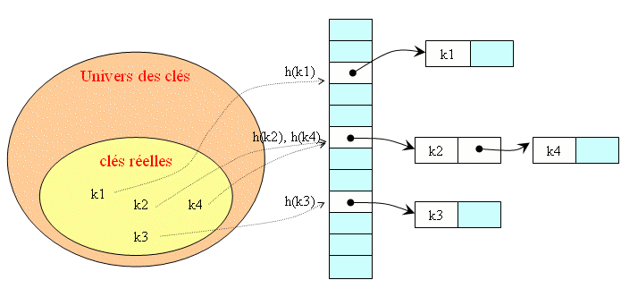
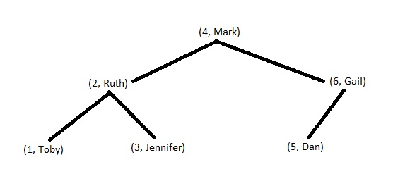

# cour : Map 

## I. `HashMap` :

### 1. Définition et Caractéristiques : 



* La classe `HashMap` en Java est une implémentation de la structure de données de table de hachage.

* La classe `HashMap` en Java est une implémentation de l'interface `Map` qui permet de stocker des paires clé-valeur. Elle fait partie 
du package `java.util` et offre une manière efficace de stocker et de récupérer des valeurs en utilisant des clés associées. Les clés 
dans une `HashMap` sont uniques, et chaque clé est associée à une valeur.

*  **Efficacité de Recherche :** La recherche d'une valeur en fonction de sa clé est très rapide en temps constant (O(1)) en moyenne. 


* **Pas d'Ordre :** `HashMap` ne garantit pas un ordre spécifique des clés ou des valeurs. Si vous avez besoin d'un ordre particulier, 
    vous pouvez utiliser `LinkedHashMap` (qui étend `HashMap`) pour préserver l'ordre d'insertion.


* **Quand Utiliser HashMap :**

    * Utilisez `HashMap` lorsque vous avez besoin de stocker des données sous forme de paires clé-valeur et que l'ordre des éléments 
    n'est pas important.

    * Si vous avez besoin de maintenir un ordre d'insertion, vous pouvez envisager d'utiliser `LinkedHashMap`. Si vous avez besoin d'un 
    tri naturel des clés, vous pourriez considérer `TreeMap` (qui triera les clés par ordre naturel ou par un comparateur externe).

### 2. Les Méthodes : 


1. **put(K key, V value)** : Ajoute une paire clé-valeur à la `HashMap`.

```java
HashMap<String, Integer> hashMap = new HashMap<>();
hashMap.put("apple", 1);
hashMap.put("banana", 2);
hashMap.put("orange", 3);
```

2. **get(Object key)** : Récupère la valeur associée à la clé spécifiée.

```java
Integer value = hashMap.get("apple"); // Renvoie 1
```

3. **remove(Object key)** : Supprime l'entrée associée à la clé spécifiée.

```java
hashMap.remove("banana");
```

4. **containsKey(Object key)** : Vérifie si la `HashMap` contient la clé spécifiée.

```java
boolean containsApple = hashMap.containsKey("apple"); // Renvoie true
boolean containsGrapes = hashMap.containsKey("grapes"); // Renvoie false
```

5. **containsValue(Object value)** : Vérifie si la `HashMap` contient la valeur spécifiée.

```java
boolean containsValue1 = hashMap.containsValue(1); // Renvoie true
boolean containsValue5 = hashMap.containsValue(5); // Renvoie false
```

6. **size()** : Renvoie le nombre de paires clé-valeur dans la `HashMap`.

```java
int size = hashMap.size();
```

7. **isEmpty()** : Vérifie si la `HashMap` est vide.

```java
boolean isEmpty = hashMap.isEmpty();
```

8. **keySet()** : Renvoie un ensemble de toutes les clés dans la `HashMap`.

```java
Set<String> keys = hashMap.keySet();
```

9. **values()** : Renvoie une collection de toutes les valeurs dans la `HashMap`.

```java
Collection<Integer> values = hashMap.values();
```

10. **entrySet()** : Renvoie un ensemble de toutes les entrées (paires clé-valeur) dans la `HashMap`.

```java
Set<Map.Entry<String, Integer>> entries = hashMap.entrySet();
```

11. **clear()** : Supprime toutes les paires clé-valeur de la `HashMap`.

```java
hashMap.clear();
```

### 3. Parcourir un `HashMap` :

Pour parcourir un `HashMap` en Java, vous pouvez utiliser des itérations à l'aide d'itérateurs, de boucles `for-each` ou des méthodes `keySet()`, `values()` et `entrySet()`. Voici différentes méthodes pour parcourir un `HashMap` :

**1. Parcours des clés et des valeurs à l'aide de `entrySet()` :**
```java
import java.util.HashMap;
import java.util.Map;

public class HashMapExample {
    public static void main(String[] args) {
        HashMap<String, Integer> hashMap = new HashMap<>();
        hashMap.put("Alice", 25);
        hashMap.put("Bob", 30);
        hashMap.put("Charlie", 28);

        for (Map.Entry<String, Integer> entry : hashMap.entrySet()) {
            String key = entry.getKey();
            Integer value = entry.getValue();
            System.out.println("Clé : " + key + ", Valeur : " + value);
        }
    }
}
```

**2. Parcours des clés avec `keySet()` :**
```java
import java.util.HashMap;
import java.util.Map;

public class HashMapExample {
    public static void main(String[] args) {
        HashMap<String, Integer> hashMap = new HashMap<>();
        hashMap.put("Alice", 25);
        hashMap.put("Bob", 30);
        hashMap.put("Charlie", 28);

        for (String key : hashMap.keySet()) {
            Integer value = hashMap.get(key);
            System.out.println("Clé : " + key + ", Valeur : " + value);
        }
    }
}
```

**3. Parcours des valeurs avec `values()` :**
```java
import java.util.HashMap;
import java.util.Map;

public class HashMapExample {
    public static void main(String[] args) {
        HashMap<String, Integer> hashMap = new HashMap<>();
        hashMap.put("Alice", 25);
        hashMap.put("Bob", 30);
        hashMap.put("Charlie", 28);

        for (Integer value : hashMap.values()) {
            System.out.println("Valeur : " + value);
        }
    }
}
```


## II. ``TreeMap`` :


### 1.Définition et Carcatéristiques :



* La classe `TreeMap` en Java est une implémentation de l'interface `NavigableMap` qui stocke des paires clé-valeur, mais contrairement 
à `HashMap`, les éléments dans une `TreeMap` sont automatiquement triés selon l'ordre des clés.

* **Tri Automatique :** Les clés dans une `TreeMap` sont automatiquement triées. Vous pouvez spécifier un comparateur externe pour 
personnaliser l'ordre de tri.

* **Efficacité de Recherche :** La recherche, l'insertion et la suppression d'éléments dans une `TreeMap` ont généralement une complexité de temps de O(log n), où n est le nombre d'éléments dans la map. 

* **Arbre Rouge-Noir :** La `TreeMap` utilise une structure d'arbre rouge-noir pour maintenir les clés triées et équilibrées. Cela 
garantit des performances de recherche et de manipulation stables.

* **Quand Utiliser TreeMap :**

    - Utilisez `TreeMap` lorsque vous avez besoin de stocker des données sous forme de paires clé-valeur et que vous avez besoin de les 
    maintenir automatiquement triées par leurs clés. 


### 2. Les Méthodes de la classe `TreeMap` :


1. **`put(K key, V value)` :** Ajoute une paire clé-valeur à la TreeMap. Si la clé existe déjà, sa valeur sera mise à jour.

2. **`get(Object key)` :** Renvoie la valeur associée à la clé spécifiée.

3. **`remove(Object key)` :** Supprime la paire clé-valeur associée à la clé spécifiée.

4. **`containsKey(Object key)` :** Vérifie si la TreeMap contient la clé spécifiée.

5. **`containsValue(Object value)` :** Vérifie si la TreeMap contient la valeur spécifiée.

6. **`size()` :** Renvoie le nombre de paires clé-valeur dans la TreeMap.

7. **`isEmpty()` :** Vérifie si la TreeMap est vide.

8. **`clear()` :** Supprime toutes les paires clé-valeur de la TreeMap.

9. **`keySet()` :** Renvoie un ensemble contenant toutes les clés dans la TreeMap.

10. **`values()` :** Renvoie une collection contenant toutes les valeurs dans la TreeMap.

11. **`entrySet()` :** Renvoie un ensemble contenant toutes les paires clé-valeur dans la TreeMap.

12. **`firstKey()` :** Renvoie la première clé (plus petite) dans la TreeMap.

13. **`lastKey()` :** Renvoie la dernière clé (plus grande) dans la TreeMap.

14. **`lowerKey(K key)` :** Renvoie la plus grande clé strictement inférieure à la clé spécifiée.

15. **`higherKey(K key)` :** Renvoie la plus petite clé strictement supérieure à la clé spécifiée.

16. **`floorKey(K key)` :** Renvoie la plus grande clé inférieure ou égale à la clé spécifiée.

17. **`ceilingKey(K key)` :** Renvoie la plus petite clé supérieure ou égale à la clé spécifiée.


#### Exemples :


```java
import java.util.TreeMap;

public class TreeMapExample {
    public static void main(String[] args) {
        TreeMap<String, Integer> treeMap = new TreeMap<>();

        // Ajout de paires clé-valeur
        treeMap.put("Alice", 25);
        treeMap.put("Bob", 30);
        treeMap.put("Charlie", 28);

        // Utilisation de get()
        Integer age = treeMap.get("Alice");
        System.out.println("L'âge d'Alice : " + age); // Affiche 25

        // Vérification de la présence d'une clé avec containsKey()
        boolean containsBob = treeMap.containsKey("Bob");
        System.out.println("Contient Bob : " + containsBob); // Affiche true

        // Utilisation de keySet() pour obtenir les clés
        System.out.println("Clés dans la TreeMap : " + treeMap.keySet());

        // Utilisation de values() pour obtenir les valeurs
        System.out.println("Valeurs dans la TreeMap : " + treeMap.values());

        // Suppression d'une paire clé-valeur avec remove()
        treeMap.remove("Charlie");
        System.out.println("Après suppression : " + treeMap);

        // Utilisation de firstKey() et lastKey()
        String firstKey = treeMap.firstKey();
        String lastKey = treeMap.lastKey();
        System.out.println("Première clé : " + firstKey); // Affiche "Alice"
        System.out.println("Dernière clé : " + lastKey); // Affiche "Bob"
    }
}
```

### 3. Parcourir un `TreeMap` :


**1. Parcours des clés et des valeurs à l'aide de `entrySet()` :**
```java
import java.util.TreeMap;
import java.util.Map;

public class TreeMapExample {
    public static void main(String[] args) {
        TreeMap<String, Integer> treeMap = new TreeMap<>();
        treeMap.put("Alice", 25);
        treeMap.put("Bob", 30);
        treeMap.put("Charlie", 28);

        for (Map.Entry<String, Integer> entry : treeMap.entrySet()) {
            String key = entry.getKey();
            Integer value = entry.getValue();
            System.out.println("Clé : " + key + ", Valeur : " + value);
        }
    }
}
```

**2. Parcours des clés avec `keySet()` :**
```java
import java.util.TreeMap;
import java.util.Map;

public class TreeMapExample {
    public static void main(String[] args) {
        TreeMap<String, Integer> treeMap = new TreeMap<>();
        treeMap.put("Alice", 25);
        treeMap.put("Bob", 30);
        treeMap.put("Charlie", 28);

        for (String key : treeMap.keySet()) {
            Integer value = treeMap.get(key);
            System.out.println("Clé : " + key + ", Valeur : " + value);
        }
    }
}
```

**3. Parcours des valeurs avec `values()` :**
```java
import java.util.TreeMap;

public class TreeMapExample {
    public static void main(String[] args) {
        TreeMap<String, Integer> treeMap = new TreeMap<>();
        treeMap.put("Alice", 25);
        treeMap.put("Bob", 30);
        treeMap.put("Charlie", 28);

        for (Integer value : treeMap.values()) {
            System.out.println("Valeur : " + value);
        }
    }
}
```


