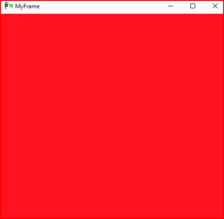

# cour 30 : Swing


## 1. **Introduction** :

- **``Swing``:**

    >Swing est une bibliothèque graphique pour le développement d'interfaces utilisateur (GUI) en Java. Elle fait partie du kit de développement logiciel Java (JDK) et offre une plateforme robuste pour la création d'applications graphiques interactives.


- **``GUI`` (Graphical User Interface) :** 
    
    - *Une interface utilisateur graphique:* permet à l'utilisateur d'interagir avec un programme via des éléments graphiques tels que fenêtres, boutons, menus déroulants, boîtes de dialogue, etc. Swing facilite la création de ces éléments graphiques.


- **``Composants Swing ``:** 
    
    - Swing propose une grande variété de composants : 
        
        - des fenêtres (JFrame), 
        
        - des boutons (JButton), 
        
        - des zones de texte (JTextField), 
        
        - des menus (JMenu) ..etc 


- **``Portabilité`` :** 
    
    - L'un des principaux avantages de Swing est sa portabilité. 
    
    - Les applications développées avec Swing sont indépendantes de la plateforme, ce qui signifie qu'elles peuvent fonctionner sur différentes plates-formes sans modifications majeures.


## 2. **frames : `JFrame`** : 

### 2.1 **Description:**


- `JFrame` est une classe de Swing, située dans le package `javax.swing`. 

- Elle représente une fenêtre avec des bordures, des barres de titre et des boutons de contrôle pour minimiser, maximiser et fermer. 

- Elle est un composant essentiel pour la création d'applications GUI  en Java.

- Le rôle principal de la classe `JFrame` est de fournir une fenêtre rectangulaire où vous pouvez ajouter d'autres composants graphiques (boutons, zones de texte, panneaux, etc.) pour créer des interfaces utilisateur interactives.


### 2.2 .**Principales méthodes :**

1. **Constructeurs :**

    - `JFrame()`: Constructeur par défaut pour créer un objet `JFrame`.
    - `JFrame(String title)`: Constructeur pour définir le titre de la fenêtre.

    - **Exemple :**
        ```java
        JFrame frame = new JFrame("Ma Fenêtre");
        ```


2. `setVisible(boolean b)` :
 
    - **Définition :** Cette méthode permet de rendre la fenêtre visible ou invisible en fonction de la valeur booléenne fournie.
    - **Signature :** `public void setVisible(boolean b)`
    - **Rôle :** Lorsque cette méthode est appelée avec `true`, la fenêtre devient visible. Si elle est appelée avec `false`, la fenêtre devient invisible.
    - **Exemple :**
        ```java
        JFrame frame = new JFrame("Ma Fenêtre");
        frame.setVisible(true); // Rend la fenêtre visible
        ```

3. `setTitle(String title)` :
 
    - **Définition :** Cette méthode permet de définir le titre de la fenêtre.
    - **Signature :** `public void setTitle(String title)`
    - **Rôle :** Cette méthode affecte le titre de la fenêtre avec la chaîne de caractères fournie en argument.
    - **Exemple :**
        ```java
        frame.setTitle("Ma Fenêtre Principale"); // Définit le titre de la fenêtre
        ```

4. `setSize(int width, int height)` :
    
    - **Définition :** Cette méthode détermine la taille de la fenêtre en pixels.
    - **Signature :** `public void setSize(int width, int height)`
    - **Rôle :** Elle définit la largeur et la hauteur de la fenêtre en pixels.
    - **Exemple :**
        ```java
        frame.setSize(800, 600); // Définit la taille de la fenêtre à 800x600 pixels
        ```

5. `setIconImage(Image image)` :
    - **Définition :** Cette méthode définit l'icône associée à la fenêtre.
    - **Signature :** `public void setIconImage(Image image)`
    - **Rôle :** Elle associe une image donnée en argument à l'icône de la fenêtre.
    - **Exemple :**
        
        ```java
            ImageIcon image = new ImageIcon("../images/logo_ensimag.png");

            frame.setIconImage(image.getImage());  // Définit l'icône de la fenêtre

        ```

6. `getContentPane()` :
    - **Définition :** Cette méthode retourne le conteneur de contenu de la fenêtre.
    - **Signature :** `public Container getContentPane()`
    - **Rôle :** Elle renvoie le conteneur où les composants graphiques de la fenêtre sont ajoutés.
    - **Exemple :**
        ```java
        Container contentPane = frame.getContentPane();
        ```

7. `setBackground(Color bgColor)` :

    - **Définition :** Cette méthode définit la couleur de fond de la fenêtre.

    - **Signature :** `public void setBackground(Color bgColor)`
        
    - **Rôle :** Elle définit la couleur de fond de la fenêtre en utilisant l'objet Color fourni.
    
    
    - **Exemple :**
        ```java
                frame.getContentPane().setBackground(new Color(0xFFFFFF)); // Définit la couleur de fond de la fenêtre en bleu
        ```


8. `setDefaultCloseOperation(int operation)` :
    
    - **Rôle :** 
        - permet de définir le comportement par défaut de la fenêtre lorsque l'utilisateur tente de la fermer en cliquant sur le bouton de fermeture de la fenêtre (la croix dans le coin supérieur droit de la fenêtre).

    - **Signature :**
        ```java
        public void setDefaultCloseOperation(int operation)
        ```

        - Le paramètre `operation` est une constante entière qui indique le comportement souhaité :

            - `JFrame.DO_NOTHING_ON_CLOSE` : Lorsque l'utilisateur tente de fermer la fenêtre, rien ne se produit. La fenêtre reste ouverte.
            
            - `JFrame.HIDE_ON_CLOSE` : La fenêtre est cachée mais reste en mémoire. Elle peut être rendue visible à nouveau.
            
            - `JFrame.DISPOSE_ON_CLOSE` : La fenêtre est fermée, libérant ainsi les ressources utilisées par la fenêtre. Cela ne ferme pas l'application complète, mais seulement la fenêtre spécifique.
            
            - `JFrame.EXIT_ON_CLOSE` : L'application entière se ferme lorsque la fenêtre est fermée.

    - **Exemple :**
        ```java
        JFrame frame = new JFrame("Ma Fenêtre");
        frame.setDefaultCloseOperation(JFrame.EXIT_ON_CLOSE); // Quitte l'application lorsque la fenêtre est fermée
        ```

8. **`pack()`:**

    - La méthode `pack()` est utilisée pour dimensionner la fenêtre (JFrame) pour qu'elle s'adapte à la taille naturelle de ses composants. 
    
    - Cela est utile après avoir ajouté des composants à une fenêtre pour qu'elle ajuste sa taille pour les afficher correctement.

    - **Signature :**
        ```java
        public void pack()
        ```

    - **Exemple :**

        ```java
        import javax.swing.*;

        public class JFrameExample {
            public static void main(String[] args) {
                JFrame frame = new JFrame("Exemple de JFrame");
                frame.setDefaultCloseOperation(JFrame.EXIT_ON_CLOSE);

                // Ajoute des composants au JFrame
                
                frame.pack(); // Redimensionne la fenêtre pour s'adapter aux composants ajoutés
                frame.setVisible(true);
            }
        }
        
        ```


### 2.3 **héritage de `JFrame` :**

- **Description:**
 
    >Hériter de la classe `JFrame` en créant une classe personnalisée, telle que `MyFrame`, offre une approche structurée et modulaire pour la création d'une fenêtre graphique. 

    - Si vous avez plusieurs fenêtres avec un comportement ou une apparence similaires, hériter de `JFrame` pour créer une classe de fenêtre personnalisée permet une réutilisation facile du code.

- **Exemple :**

    ```java
    import javax.swing.JFrame;

    public class MyFrame extends JFrame {
        public MyFrame(String title) {
            super(title); // Appel du constructeur de la classe parente (JFrame) avec le titre
            // Autres configurations ou initialisations peuvent être faites ici
            this.setSize(800, 600);
            this.setDefaultCloseOperation(JFrame.EXIT_ON_CLOSE);
            // Autres configurations de la fenêtre
        }
    }
    ```


### 2.4 . **Exemple Complet:**

- **Myframe.java:**


```java

package packages;


import javax.swing.JFrame;
import javax.swing.ImageIcon;
import java.awt.Color;


public class MyFrame extends JFrame {


    public MyFrame(String title) {

        super(title);

        this.setVisible(true);
        this.setSize(420,420);
        this.setDefaultCloseOperation(JFrame.EXIT_ON_CLOSE);
        
        ImageIcon image = new ImageIcon("images/logo_ensimag.png");

        this.setIconImage(image.getImage());  
        this.getContentPane().setBackground(new Color(0xFF1220));
    }
    
}


```

- **Main.java**


```java
import packages.MyFrame;

public class Main {
    
    public static  void main(String[] args) 
    {
        // on instace une fénetre graphique 

        new MyFrame("MyFrame");
    
    }
}

```


