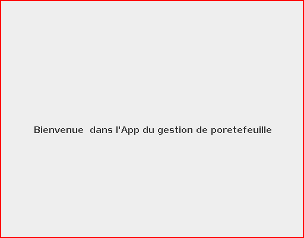

# cour : **`positionnement ` :**


## 1 **Introduction:**

- **Définition:**

    >**Le positionnement** dans un composant `JLabel` (ou tout autre composant graphique) se réfère à la manière dont ce composant est disposé ou positionné à l'intérieur d'un conteneur, tel qu'une fenêtre.


    - Le positionnement d'un composant `JLabel` implique le placement de ce composant à des coordonnées spécifiques à l'intérieur d'un conteneur parent, déterminant ainsi où il apparaîtra à l'écran.


- **Types:**

    on peut discuter de manière générale des idées de positionnement interne et externe par rapport à l'agencement visuel des éléments d'une étiquette (`JLabel`) au sein d'un conteneur :

    - **positionnement interne:** se réfère à la manière dont le contenu (texte, icône) est disposé à l'intérieur de la ``JLabel``, 
    
    - **positionnement externe:** se réfère à la place de la JLabel au sein du conteneur (fenêtre, panneau), qui est généralement géré par les gestionnaires de disposition ou des méthodes de positionnement absolu.


## 2. **Positionnement Interne dans ``JLabel`` :**


### 2.1 .**Positonnemt de Text par rapport à l'icon:**

- **Description:**
    
    >les méthodes `setHorizontalTextPosition` et `setVerticalTextPosition`  sont utilisées pour définir la position du texte par rapport à l'icône dans le label.

    
- **Signature :**
    ```java
    public void setHorizontalTextPosition(int textPosition);
    public void setVerticalTextPosition(int textPosition)

    ```
    
    - ``setHorizontalTextPosition():`` les valeurs possibles sont  ``JLabel.CENTE`` , ``JLabel.LEFT`` , ``JLabel.RIGHT``

    - ``setVerticalTextPosition():`` les valeurs possibles sont   ``JLabel.CENTE`` , ``JLabel.TOP`` , ``JLabel.BOTTOM``


- **Exemple :**

    ```java
    import javax.swing.JLabel;


    public class Main {
        public static void main(String[] args) {
        // lables :
        JLabel label = new JLabel();
        label.setText("---- Page d'accueil : -------");       
        label.setIcon(new ImageIcon("images/programmation.png"));
        // label.setIconTextGap(20);
        label.setHorizontalTextPosition(JLabel.CENTER);
        label.setVerticalTextPosition(JLabel.TOP);

        

        // frame : 

        JFrame frame = new JFrame("My Frame");
    
        frame.setVisible(true);
        frame.setDefaultCloseOperation(JFrame.EXIT_ON_CLOSE);
        frame.setSize(1000,1000);
        frame.add(label);   
        
        }
    }
    ```


    


### 2.2 **Positionnement de l'icon et texte dans le label :**


- `setHorizontalAlignment(int alignment):`

    - **Définition :** Définit l'alignement horizontal du texte ou de l'icône dans le label.

    - **Signature :** `public void setHorizontalAlignment(int alignment)`

    - **Rôle :** Aligne le texte ou l'icône horizontalement selon les constantes `SwingConstants.LEFT`, `SwingConstants.CENTER`, ou `SwingConstants.RIGHT`.

    - **Exemple :**
        ```java
        JLabel label = new JLabel("Alignement à gauche");
        label.setHorizontalAlignment(SwingConstants.LEFT);
        
        ```

- `setVerticalAlignment(int alignment):`

    - **Définition :** Définit l'alignement vertical du texte ou de l'icône dans le label.

    - **Signature :** `public void setVerticalAlignment(int alignment)`

    - **Rôle :** Aligne le texte ou l'icône verticalement selon les constantes `SwingConstants.TOP`, `SwingConstants.CENTER`, ou `SwingConstants.BOTTOM`.

    - **Exemple :**
        ```java
        JLabel label = new JLabel("Alignement en haut");
        label.setVerticalAlignment(SwingConstants.TOP);


        ```


- **Exemple:**


    ```java

    import java.awt.Font;

    import javax.swing.JFrame;
    import javax.swing.JLabel;
    import javax.swing.SwingConstants;

    public class Main {
        
        public static void main(String[] args) {
            JFrame frame = new JFrame("Title");
            frame.setVisible(true);
            frame.setSize(500 , 500);
            frame.setDefaultCloseOperation(JFrame.EXIT_ON_CLOSE);


            JLabel  titre = new JLabel("Bienvenue  dans l'App du gestion de poretefeuille");
            titre.setFont(new Font("Times New Roman", Font.BOLD, 15));
            titre.setHorizontalAlignment(SwingConstants.CENTER);
            titre.setVerticalAlignment(SwingConstants.CENTER);        
            
            
            
            
            
            
            frame.add(titre);
        }
    }

    ```


    


## 3. **Positionnement Externe:**


### 3.1 **Gestionnaires de disposition (``Layout Managers``) :**


-   **``Layout Managers ``:** 
    >sont des classes en Java ``Swing`` utilisées pour définir la manière dont les composants graphiques (tels que les boutons, les étiquettes, les champs de texte .. etc) sont disposés à l'intérieur d'un conteneur, comme une fenêtre (JFrame).

- Le positionnement externe de la ``JLabel`` dans un conteneur est déterminé par le conteneur lui-même et par les gestionnaires de disposition utilisés.


- Ils permettent de contrôler la disposition, la taille et l'alignement des composants dans une interface graphique. Chaque gestionnaire de mise en page a ses propres règles d'organisation et d'agencement des composants.


### 3.2 **Positionnement absolu :** 


- **Description:**

    - Dans le cas du positionnement absolu, le positionnement externe peut être contrôlé en définissant les coordonnées et les dimensions spécifiques de la JLabel via la méthode `setBounds()` .

    - `frame.setLayout(null) :` est une méthode  utilisée pour positionner les composants de manière absolue dans un conteneur Swing, tel qu'un JFrame. Lorsque vous définissez le LayoutManager d'un conteneur à `null`, vous désactivez essentiellement le gestionnaire de mise en page par défaut. Cela signifie que vous êtes responsable de définir explicitement la position (coordonnées x et y) et la taille des composants que vous ajoutez à ce conteneur.


- **la méthode `setBounds()`:**

    >La méthode `setBounds(int x, int y, int width, int height)` est utilisée pour définir la position et les dimensions d'un composant, tel qu'un `JLabel` dans Java Swing.

    - **Signature :**

        ```java
        public void setBounds(int x, int y, int width, int height)
        ```

        - Cette méthode prend quatre paramètres :
        - `x` : La coordonnée x qui représente la position horizontale du coin supérieur gauche du composant par rapport à son conteneur parent.
        - `y` : La coordonnée y qui représente la position verticale du coin supérieur gauche du composant par rapport à son conteneur parent.
        - `width` : La largeur du composant.
        - `height` : La hauteur du composant.


- **Exemple d'utilisation avec `JLabel` :**

    ```java
    import javax.swing.*;

    public class Main {
        public static void main(String[] args) {
            JFrame frame = new JFrame("Exemple de JLabel avec setBounds");
            frame.setDefaultCloseOperation(JFrame.EXIT_ON_CLOSE);
            frame.setLayout(null); // Désactivation du Layout Manager par défaut

            JLabel label = new JLabel("Mon JLabel");
            label.setBounds(50, 50, 150, 30); // Position (50, 50) et taille (150, 30) du JLabel

            frame.add(label);
            frame.setSize(300, 200);
            frame.setVisible(true);
        }
    }
    ```


### **RQ :**

- Il est important de noter que l'utilisation de `setBounds` pour placer les composants de manière absolue est déconseillée, car cela peut rendre l'interface utilisateur moins adaptable. L'utilisation des Layout Managers est généralement préférée pour créer des interfaces flexibles et adaptables à différents environnements et tailles d'écran.


