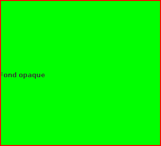

# cour 07 : **Background :**


## 1. **Définition :**


>Le **background** d'un composant graphique fait référence à la zone d'arrière-plan de ce composant.

- **Pour un JLabel :**
    >le background correspond à la zone derrière le texte affiché, celle qui n'est pas occupée par le texte ou une éventuelle icône. Il s'agit de la zone sur laquelle la couleur de fond est appliquée.


# 2. **Changement du couleur du Background :**

- **Description:**

    >La couleur du **background** peut être modifiée à l'aide de la méthode `setBackground(Color bg)` dans Java Swing. 

    
    - Par défaut, le fond d'un JLabel est transparent, mais il peut être rendu opaque en utilisant la méthode `setOpaque(true)`. Cela signifie que le fond sera visible et aura la couleur définie par `setBackground`, au lieu de laisser le fond du conteneur parent apparaître à travers le JLabel.


- **la méthode `setBackground(Color bg)` :**

    -  **Rôle :**

        - La méthode `setBackground` est utilisée pour définir la couleur de fond d'un composant, telle que `JLabel`.

    - **Signature :**

        ```java
        public void setBackground(Color bg)
        ```


- **la méthode `setOpaque(boolean isOpaque)` :**

    - **Rôle :**
        
        - La méthode `setOpaque` est utilisée pour déterminer si un composant doit rendre sa zone de fond opaque ou transparent.

    - **Signature :**

        ```java
        public void setOpaque(boolean isOpaque)
        ```


- **Exemple d'utilisation :**

    ```java
    import javax.swing.*;

    public class Main {
        public static void main(String[] args) {
            JFrame frame = new JFrame("Changer l'opacité d'un JLabel");
            frame.setDefaultCloseOperation(JFrame.EXIT_ON_CLOSE);

            JLabel label = new JLabel("Fond opaque");
            label.setBackground(Color.GREEN);
            label.setOpaque(true); 

            frame.add(label);
            frame.setSize(300, 200);
            frame.setVisible(true);
        }
    }
    ```

    