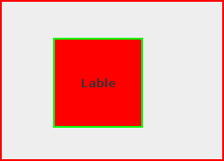

## cour : **``Bordure``**


## 1 **Définition :**

>**Les bordures** dans les composants graphiques, tels que le ``JLabel``, font référence à la zone entourant le composant, permettant de délimiter visuellement son contour ou de le séparer des autres composants.

- Les bordures sont utilisées pour ajouter des détails visuels, améliorer l'esthétique et la lisibilité de l'interface utilisateur, ainsi que pour fournir des indications visuelles sur les limites et la séparation entre les composants.


## 2 **la classe ``Border``:**


- **Description:**

    >La classe `javax.swing.border.Border` est une classe abstraite dans Java Swing, utilisée pour définir les différentes bordures qui peuvent être appliquées aux composants graphiques pour leur donner une apparence visuelle spécifique.


- **Types:**

    - `LineBorder` :
        >La classe `javax.swing.border.LineBorder` est utilisée pour créer une bordure simple sous forme de lignes droites autour d'un composant graphique dans une interface utilisateur Java Swing.
    
    
- **Synatxe:**

    ```java
    Border border = TypeBorder(Color color , int taille)

    ```


    
- **Exemple d'utilisation :**

    ```java
    import javax.swing.*;
    import javax.swing.border.LineBorder;
    import java.awt.Color;

    public class LineBorderExample {
        public static void main(String[] args) {
            JFrame frame = new JFrame("Exemple de LineBorder");
            frame.setDefaultCloseOperation(JFrame.EXIT_ON_CLOSE);

            JLabel label = new JLabel("Bordure de ligne");
            label.setBorder(new LineBorder(Color.BLACK, 2)); // Bordure de ligne noire de 2 pixels

            frame.add(label);
            frame.setSize(300, 200);
            frame.setVisible(true);
        }
    }
    ```


## 3. **la méthode `setBorder()` :**


- **Description:**

    >La méthode `setBorder(Border border)` de la classe `JLabel` permet de définir une bordure pour le composant ``JLabel``. 

    - Cette bordure peut être une des différentes classes héritant de `javax.swing.border.Border`, telles que `LineBorder`, `EtchedBorder`, `BevelBorder`, etc.


- **Signature :**

    ```java
    public void setBorder(Border border)
    ```


- **Exemple d'utilisation avec `LineBorder` :**

    ```java


    import java.awt.Color;

    import javax.swing.JFrame;
    import javax.swing.JLabel;
    import javax.swing.SwingConstants;
    import javax.swing.border.LineBorder;

    public class Main {
        
        public static void main(String[] args) {
            
            JFrame frame = new JFrame("Title");

            frame.setVisible(true);
            frame.setDefaultCloseOperation(JFrame.EXIT_ON_CLOSE);
            frame.setSize(500 , 500);
            frame.setLayout(null);


            JLabel label = new JLabel("Lable");

            label.setHorizontalAlignment(SwingConstants.CENTER);
            label.setVerticalAlignment(SwingConstants.CENTER);

            label.setBorder(new LineBorder(Color.GREEN , 2));
            
            label.setOpaque(true);
            label.setBackground(Color.RED);
            label.setBounds(200 , 200 , 100 , 100);


            frame.add(label);


        }

    }


    ```


    