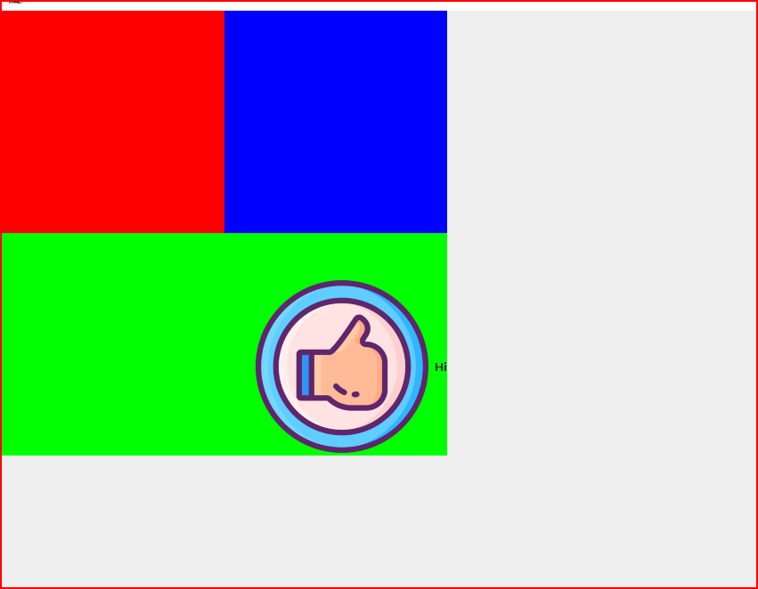

# cour 09 : **``JPanel``**

## 1. **Introduction :la classe `JPanel`** 


- **défintion:**

    >Un `JPanel` en Swing est une classe  qui représente un conteneur léger, flexible et redimensionnable utilisé pour organiser et regrouper d'autres composants graphiques (boutons, étiquettes, champs de texte, etc.) au sein d'une interface utilisateur.


    - Le `JPanel` est utilisé pour organiser visuellement les composants d'une interface graphique. Il peut servir à diviser l'interface en zones logiques, à regrouper des composants similaires, ou à créer des sections distinctes dans une fenêtre Swing.


- **Constructeur du ``JPanel``:**

    - **Rôle :** Crée un nouveau JPanel sans aucun composant.

    - **Signature :** `public JPanel()`

    - **Exemple :** 
    ```java
    JPanel panel = new JPanel();
    ```


## 2. **Principales méthodes :**

### 2.1. **`add(Component comp)` :**

- **Rôle :** Ajoute un composant au JPanel.

- **Signature :** `public Component add(Component comp)`

- **Exemple :** 
    ```java
    JPanel panel = new JPanel();
    JLabel label = new JLabel("Mon label");
    panel.add(label);
    ```

### 2.2 **`setBackground(Color bg)`**

- **Rôle :** Définit la couleur d'arrière-plan du JPanel.

- **Signature :** `public void setBackground(Color bg)`

- **Exemple :** 
    ```java
    JPanel panel = new JPanel();
    panel.setBackground(Color.LIGHT_GRAY);
    ```

### 2.3 **`setLayout(LayoutManager manager)`**

- **Rôle :** Définit le `LayoutManager` pour organiser les composants à l'intérieur du JPanel.

- **Signature :** `public void setLayout(LayoutManager manager)`

- **Exemple :** 
    ```java
    JPanel panel = new JPanel();
    panel.setLayout(new FlowLayout());
    ```

### 2.4 **`setBorder(Border border)`**

- **Rôle :** Ajoute une bordure spécifiée au JPanel.

- **Signature :** `public void setBorder(Border border)`

- **Exemple :** 
    ```java
    JPanel panel = new JPanel();
    panel.setBorder(BorderFactory.createLineBorder(Color.BLACK));
    ```

### 2.5 **`setBounds(int x, int y, int width, int height)`:**

    
- **Role:** La méthode `setBounds(int x, int y, int width, int height)` est  utilisée pour définir la position et la taille d'un composant à l'intérieur de son conteneur.

- **Signature:**
    ```java
    setBounds(int x, int y, int width, int height)
    ```

- **Exemple:**

    ```java
    import javax.swing.*;

    public class Main {
        public static void main(String[] args) {
            JFrame frame = new JFrame("Exemple de setBounds avec JPanel");
            frame.setDefaultCloseOperation(JFrame.EXIT_ON_CLOSE);

            JPanel panel = new JPanel();
            panel.setLayout(null); // Désactivation du Layout Manager pour utiliser setBounds

            JButton button = new JButton("Mon Bouton");
            button.setBounds(50, 50, 100, 30); // Position (50, 50) et taille (100, 30) du bouton à l'intérieur du JPanel

            panel.add(button);
            frame.add(panel);
            frame.setSize(300, 200);
            frame.setVisible(true);
        }
    }
    ```


## 3. **Exemple :**

- **Main.java**

```java

import java.awt.BorderLayout;
import java.awt.Color;

import javax.swing.ImageIcon;
import javax.swing.JFrame;
import javax.swing.JLabel;
import javax.swing.JPanel;


public class Main {
    
    public static void main(String[] args) {

        


        // Label :
        JLabel label = new JLabel("Hi");
        label.setIcon(new ImageIcon("images/thumbs.png")); 
        label.setVerticalAlignment(JLabel.BOTTOM);
        label.setHorizontalAlignment(JLabel.RIGHT);


        // Panel : 

        JPanel redPanel = new JPanel();
        redPanel.setBackground(Color.RED);
        redPanel.setBounds(0,0,250,250);
        
        JPanel bluePanel = new JPanel();
        bluePanel.setBackground(Color.BLUE);
        bluePanel.setBounds(250,0,250,250);

        JPanel greenPanel = new JPanel();
        greenPanel.setBackground(Color.GREEN);
        greenPanel.setBounds(0,250,500,250);
        greenPanel.setLayout(new BorderLayout());
        
        
        
        
        
        
        
        
        // frame :
        JFrame frame = new JFrame("Panels"); 
        frame.setSize(750,750);
        frame.setDefaultCloseOperation(JFrame.EXIT_ON_CLOSE);
        frame.setVisible(true);
        frame.setLayout(null);


        // l'ajout des composantes :
        greenPanel.add(label);
        frame.add(redPanel);
        frame.add(bluePanel);
        frame.add(greenPanel);

        
    
    }
}


```


