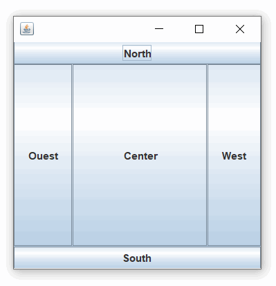
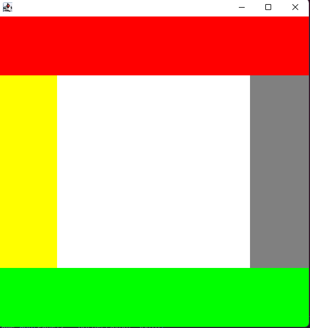

# cour 11 : **``BorderLayout()``**


- **Description:**

    >`BorderLayout` est un gestionnaire de disposition (``layout manager``) fourni par Java Swing pour organiser les composants graphiques dans un conteneur selon les points cardinaux d'une carte (nord, sud, est, ouest) et un centre. Il est utilisé pour créer des interfaces utilisateur simples où les composants sont disposés le long des bords du conteneur principal, avec un composant principal au centre.

    


- **Principes de `BorderLayout` :**

    - Chaque conteneur géré par `BorderLayout` est divisé en cinq zones : nord, sud, est, ouest et centre.
    - Un composant ajouté à un conteneur avec `BorderLayout` est placé dans l'une de ces zones en fonction de la méthode `add()` utilisée.
    - Le composant ajouté au centre occupera l'espace restant après que les autres composants aient été disposés.
    - Les composants ajoutés aux autres zones (nord, sud, est, ouest) occuperont tout l'espace disponible dans leur direction respective.

- **Syntaxe :**

    La syntaxe pour utiliser `BorderLayout` est la suivante :

    ```java
    JFrame frame = new JFrame("Exemple BorderLayout");
    frame.setDefaultCloseOperation(JFrame.EXIT_ON_CLOSE);
    // on spécifie le borderLayout comme layout manager 
    frame.setLayout(new BorderLayout());

    // Ajout de composants avec BorderLayout
    frame.add(component, BorderLayout.NORTH);   // Ajout au nord
    frame.add(component, BorderLayout.SOUTH);   // Ajout au sud
    frame.add(component, BorderLayout.EAST);    // Ajout à l'est
    frame.add(component, BorderLayout.WEST);    // Ajout à l'ouest
    frame.add(component, BorderLayout.CENTER);  // Ajout au centre

    frame.setSize(400, 300);
    frame.setVisible(true);
    ```


- **Exemple :**

    Voici un exemple complet illustrant l'utilisation de `BorderLayout` pour disposer des composants dans une fenêtre Swing :

    ```java
    import java.awt.BorderLayout;
    import java.awt.Color;
    import java.awt.Dimension;

    import javax.swing.JFrame;
    import javax.swing.JPanel;

    public class Main {

        public static void main(String[] args) {
            
            JFrame frame = new JFrame();
            frame.setVisible(true);
            frame.setSize(500 ,500);
            frame.setDefaultCloseOperation(JFrame.EXIT_ON_CLOSE);
            

            JPanel Panel1 = new JPanel();
            JPanel Panel2 = new JPanel();
            JPanel Panel3 = new JPanel();
            JPanel Panel4 = new JPanel();
            JPanel Panel5 = new JPanel();

            Panel1.setBackground(Color.red);
            Panel2.setBackground(Color.green);
            Panel3.setBackground(Color.yellow);
            Panel4.setBackground(Color.gray);
            Panel5.setBackground(Color.white);

            Panel1.setPreferredSize(new Dimension(100, 100));
            Panel2.setPreferredSize(new Dimension(100, 100));
            Panel3.setPreferredSize(new Dimension(100, 100));
            Panel4.setPreferredSize(new Dimension(100, 100));
            Panel5.setPreferredSize(new Dimension(100, 100));


            frame.setLayout(new BorderLayout());

            frame.add(Panel1 , BorderLayout.NORTH);
            frame.add(Panel2 , BorderLayout.SOUTH);
            frame.add(Panel3 , BorderLayout.WEST);
            frame.add(Panel4 , BorderLayout.EAST);
            frame.add(Panel5 , BorderLayout.CENTER);


        }
    }

    ```


    


#### RQ : **margin**

- `BorderLayout(int hgap, int vgap)` permet de créer un gestionnaire de disposition BorderLayout avec des espaces horizontaux (hgap) et verticaux (vgap) spécifiés entre les composants placés dans différentes zones :
    
    - `hgap` : spécifie l'espace horizontal  entre les composants ``WEST`` et ``EAST``.
    - `vgap` : spécifie l'espace vertical entre les composants ``NORTH`` et ``SOUTH``.
