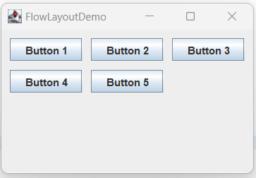
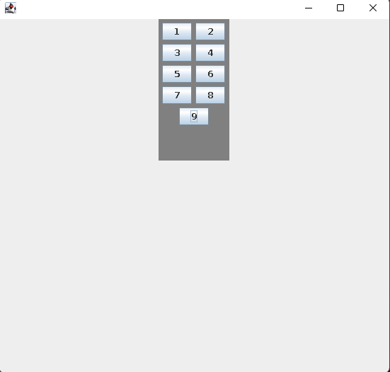

# cour 12 : **``FlowLayout``**


- **Description:**

    >Le `FlowLayout` est un gestionnaire de disposition (layout manager) fourni par Java Swing pour organiser les composants graphiques dans un conteneur en une seule ligne, en suivant le flux naturel des composants. 
    
    - Il est utilisé lorsque vous souhaitez que les composants soient placés l'un à côté de l'autre, dans l'ordre où ils sont ajoutés, et que les composants supplémentaires sont placés sur la ligne suivante si l'espace est insuffisant.


    


- **Constructuer ``FlowLayout()``**

    ```java
    public FlowLayout(int align, int hgap, int vgap)
    ```

    - `align` : L'alignement horizontal des composants. Il peut être :
        `FlowLayout.LEFT`, `FlowLayout.CENTER`, `FlowLayout.RIGHT`, `FlowLayout.LEADING` (aligné à gauche ) ou `FlowLayout.TRAILING` (aligné à droite ).
    - `hgap` : L'espacement horizontal entre les composants (en pixels).
    - `vgap` : L'espacement vertical entre les composants (en pixels).


- **Exemple:**

    ```java

    import java.awt.Color;
    import java.awt.Dimension;
    import java.awt.FlowLayout;

    import javax.swing.JButton;
    import javax.swing.JFrame;
    import javax.swing.JPanel;


    public class Main {
        public static void main(String[] args) {
            JFrame frame = new JFrame();
            frame.setSize(500 , 500);
            frame.setDefaultCloseOperation(JFrame.EXIT_ON_CLOSE);
            
            frame.setLayout(new FlowLayout(FlowLayout.CENTER , 10 ,0));

            JPanel Panel = new JPanel();

            Panel.setPreferredSize(new Dimension(100 , 200));
            Panel.setLayout(new FlowLayout());
            Panel.setBackground(Color.gray);
            Panel.add(new JButton("1"));
            Panel.add(new JButton("2"));
            Panel.add(new JButton("3"));
            Panel.add(new JButton("4"));
            Panel.add(new JButton("5"));
            Panel.add(new JButton("6"));
            Panel.add(new JButton("7"));
            Panel.add(new JButton("8"));
            Panel.add(new JButton("9"));

            frame.add(Panel);
            frame.setVisible(true);

        }    
    }


    ```

    

