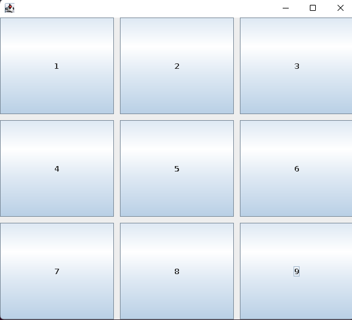

# cour 13 :**``GridLayout :``**


- **Description:**

    >Le `GridLayout` est un gestionnaire de disposition (layout manager) fourni par Java Swing qui organise les composants graphiques dans une grille régulière de cellules. Dans cette grille, chaque cellule a la même taille et les composants sont placés en ligne, puis en colonne, de gauche à droite et de haut en bas.


- **constructeur ``GridLayout()`` :**

    ```java
    public GridLayout(int rows, int cols , int space_h , int space_v)
    ```

    - `rows` : Le nombre de lignes dans la grille.
    - `cols` : Le nombre de colonnes dans la grille.


- **Exemple:**


    ```java
    import java.awt.GridLayout;

    import javax.swing.JButton;
    import javax.swing.JFrame;

    public class Main {
        


        public static void main(String[] args) {
            
            JFrame frame = new JFrame();
            frame.setDefaultCloseOperation(JFrame.EXIT_ON_CLOSE);
            frame.setSize(500 , 500);

            frame.setLayout(new GridLayout(3 , 3, 10 , 10));

            frame.add(new JButton("1"));
            frame.add(new JButton("2"));
            frame.add(new JButton("3"));
            frame.add(new JButton("4"));
            frame.add(new JButton("5"));
            frame.add(new JButton("6"));
            frame.add(new JButton("7"));
            frame.add(new JButton("8"));
            frame.add(new JButton("9"));


            frame.setVisible(true);
        }
    }

    ```


    