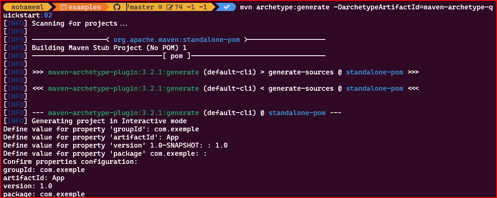

# cour 34 : **Maven** 


## 1. **Introduction :**

- **Introduction :ce qoui maven ?**

Apache Maven est un outil puissant de gestion de projet largement utilisé dans le monde du développement logiciel, en particulier pour les projets Java. Conçu pour simplifier et automatiser le processus de construction, de test et de déploiement des applications, Maven offre une structure cohérente et un ensemble de conventions qui permettent aux équipes de développement de travailler de manière plus efficace.


Le principal objectif de Maven est de simplifier la gestion du cycle de vie d'un projet logiciel. Il offre une approche standardisée pour la construction de projets, la gestion des dépendances, le déploiement d'artefacts, et bien plus encore. En un mot, Maven vise à rationaliser le développement logiciel en fournissant une infrastructure solide pour les tâches courantes.


- **Principales Fonctionnalités :**

1. **Gestion des Dépendances :** Maven excelle dans la gestion des dépendances, permettant aux développeurs de déclarer les bibliothèques dont leur projet dépend, puis laissant Maven gérer le téléchargement et l'intégration automatiques de ces dépendances.

2. **Cycles de Vie Cohérents :** Maven définit un cycle de vie de construction standardisé comprenant des phases telles que la **compilation**, les **tests**, l'emballage et le déploiement. Cette structure cohérente simplifie la gestion des différentes étapes du développement.

3. **Plugins et Extensions :** Maven est extensible grâce à un système de plugins. De nombreux plugins prêts à l'emploi sont disponibles pour des tâches courantes, et les développeurs peuvent également créer leurs propres plugins pour personnaliser le comportement de Maven.

4. **Convention sur Configuration :** Maven encourage l'adoption de conventions plutôt que de configurations complexes. Cela signifie que de nombreuses décisions par défaut sont prises pour vous, mais elles peuvent être facilement personnalisées si nécessaire.

5. **Déploiement Facile :** Maven facilite le déploiement des applications sur différents environnements, que ce soit localement, sur des serveurs de développement, ou même sur des serveurs de production.


## 2. **Installation et Configuration de Maven**


Pour installer et configurer Apache Maven sur un système Unix (comme Linux ou macOS), suivez ces étapes :

### Étape 1 : Prérequis

Assurez-vous que Java est installé sur votre système. Maven nécessite Java pour fonctionner. Vous pouvez vérifier la version de Java en utilisant la commande suivante :

```bash
java -version
```


### Étape 2 : Mettez à jour les référentiels apt-get

```bash
sudo apt-get update
```

### Étape 3 : Installez Maven

```bash
sudo apt-get install maven
```

### Étape 4 : Vérifiez l'installation

```bash
mvn -version
```

Cela devrait afficher les détails de la version de Maven, confirmant que l'installation a réussi.

L'utilisation de `apt-get` pour installer Maven garantit une installation plus simple et prend en charge les mises à jour et les désinstallations facilement gérées par le système de gestion de paquets d'Ubuntu. 


## 3. **Générer un projet Maven en ligne de commande:**

Générer un projet Maven en ligne de commande est une tâche simple grâce à l'archétype Maven. Un archétype est un modèle de projet Maven préconfiguré qui peut être utilisé pour créer rapidement un projet avec une structure de base. 

### 3.1 **la Commande `mvn archetype:generate`:**

La commande `mvn archetype:generate` est utilisée pour générer un nouveau projet Maven en se basant sur un archétype, qui est un modèle de projet prédéfini. 

```bash
mvn archetype:generate

```

La première fois que vous exécutez cette commande, Maven peut télécharger certains artefacts depuis Internet, alors assurez-vous d'avoir une connexion Internet active.

- **Interaction avec la commande :**

1. **Choix de l'archétype :** La commande vous présentera une liste d'archétypes disponibles. Vous devrez choisir celui qui correspond le mieux à votre projet. Vous pouvez sélectionner un archétype en saisissant son numéro .

2. **Fournir des informations sur le projet :** Une fois l'archétype sélectionné, Maven vous demandera des informations spécifiques au projet, telles que le `groupId` (identifiant du groupe), l'`artifactId` (identifiant de l'artefact), la `version`, le `package`, etc. Répondez à ces questions en fonction des besoins de votre projet.

3. **Confirmer la création du projet :** Maven affichera un récapitulatif des paramètres que vous avez fournis. Vérifiez-les attentivement et, si tout est correct, confirmez la création du projet.

4. **Générer le projet :** Après confirmation, Maven générera la structure du projet dans un nouveau répertoire portant le nom de l'`artifactId` que vous avez spécifié.


### 3.2 **Générer un projet quickstart:**

Le projet Maven Quickstart, également connu sous le nom d'archétype `maven-archetype-quickstart`, est un archétype Maven prédéfini qui facilite la création rapide d'un projet Java de base. Cet archétype est largement utilisé pour créer des projets Maven simples afin de démarrer rapidement le développement.

Voici quelques caractéristiques typiques du projet Quickstart Maven :

- **Structure de Base :** L'archétype crée une structure de projet de base qui suit les conventions de Maven. Cela inclut les répertoires `src/main/java` pour le code source Java, `src/test/java` pour les tests unitaires, et le fichier `pom.xml` pour la configuration du projet.

- **Fichiers Générés :** Lorsque vous générez un projet Maven avec l'archétype Quickstart, Maven crée un fichier source Java (`App.java` par défaut) dans `src/main/java`, un fichier de test associé (`AppTest.java` par défaut) dans `src/test/java`, et un fichier `pom.xml` à la racine du projet.

- **Hello World :** Le fichier source généré (`App.java`) contient généralement une classe simple avec une méthode `main` qui imprime "Hello World" à la console. Cela sert souvent d'exemple de base pour vérifier que le projet est correctement configuré.

- **Configuration Maven de Base :** Le fichier `pom.xml` généré contient une configuration minimale avec les dépendances Maven standard pour les projets Java. Il inclut également des informations sur le groupe (`groupId`), l'identifiant de l'artefact (`artifactId`), et la version du projet.

- **Facilité de Démarrage :** L'objectif principal de cet archétype est de fournir une structure de base fonctionnelle afin que les développeurs puissent commencer à écrire du code rapidement sans avoir à configurer manuellement la structure du projet.


-  Voici comment générer un projet Quickstart avec Maven à l'aide de la commande `mvn archetype:generate` :

```bash
mvn archetype:generate -DarchetypeArtifactId=maven-archetype-quickstart
```




Lorsque vous générez un projet Maven à l'aide de la commande `mvn archetype:generate`, vous devez spécifier certaines informations sur votre projet. Voici ce que signifient les principaux paramètres :

- **`groupId` (Identifiant du Groupe) :**
   - Le `groupId` représente l'identifiant du groupe auquel appartient votre projet. Il est souvent basé sur la structure du package Java .

- **`artifactId` (Identifiant de l'Artéfact) :**
   - L'`artifactId` est l'identifiant unique de votre projet. Il est utilisé pour générer le nom du fichier JAR, ainsi que le nom du répertoire contenant les fichiers du projet. Choisissez un `artifactId` significatif qui représente le nom de votre projet.

- **`version` (Version du Projet) :**
   - La `version` représente la version actuelle de votre projet. Il est généralement au format `X.Y.Z` où `X` est le numéro de version majeure, `Y` est le numéro de version mineure, et `Z` est le numéro de patch. Par exemple, `1.0.0`.

- **`package` (Package Java) :**
   - Le `package` définit la structure du package Java de votre projet. Il est généralement basé sur le `groupId` pour garantir une organisation cohérente. Par exemple, si votre `groupId` est `com.example`, le `package` pourrait être `com.example.myproject`. Le package est utilisé pour organiser les classes Java dans la hiérarchie des répertoires.


## 4.**Structure d'un Projet Maven**

La structure de base d'un projet Maven suit des conventions bien définies pour garantir une organisation cohérente et simplifier la gestion du projet. Voici une explication des principaux répertoires et fichiers dans un projet Maven :

```test
/my-project
├── src
│   ├── main
│   │   └── java
│   │       └── fr
│   │           └── exemple
│   │               └── MyClass.java
│   ├── test
│   │   └── java
│   │       └── fr
│   │           └── exemple
│   │               └── MyClassTest.java
└── pom.xml


```

### 4.1. `src` (Source)

Le répertoire `src` est le répertoire racine pour les fichiers source de votre projet. À l'intérieur de ce répertoire, vous trouverez généralement les sous-répertoires suivants :

- **`src/main` :** Contient le code source principal de votre application. Le code Java se trouve généralement dans `src/main/java`, les ressources telles que les fichiers de configuration dans `src/main/resources`, et les fichiers web dans `src/main/webapp` pour les projets web.

- **`src/test` :** Contient les fichiers source pour les tests unitaires. De manière similaire à `src/main`, vous aurez `src/test/java` pour les classes de test et `src/test/resources` pour les ressources utilisées dans les tests.

### 4.2. `target`

Le répertoire `target` est créé lors de l'exécution du cycle de vie de construction de Maven. Il contient les fichiers générés pendant la compilation, l'emballage, et d'autres phases du cycle de vie. Par exemple, le fichier JAR final (ou autre type d'archive) sera généralement situé dans `target`.

### 4.3 `pom.xml` (Project Object Model)

Le fichier `pom.xml` est le fichier de configuration principal de Maven. Il contient des informations essentielles sur le projet, telles que le nom du projet, la version, les dépendances, les plugins, les paramètres de construction, etc. C'est ici que vous définissez la configuration spécifique à votre projet.

Voici une structure de base d'un fichier `pom.xml` :

```xml
<project>
    <modelVersion>4.0.0</modelVersion>
    <groupId>com.example</groupId>
    <artifactId>my-project</artifactId>
    <version>1.0.0</version>
    <!-- Autres éléments du POM -->
</project>
```

### 4.4. Autres Répertoires Optionnels

En plus des répertoires mentionnés ci-dessus, vous pourriez également rencontrer d'autres répertoires dans un projet Maven :

- **`src/site` :** Contient la documentation du projet au format site Maven.

- **`src/assembly` :** Utilisé pour la création d'assemblages personnalisés.

- **`src/it` :** Pour les tests d'intégration.

- **`src/bin` :** Pour les scripts exécutables.

- **`src/app` :** Pour les fichiers spécifiques à l'application.

La force de Maven réside dans la convention sur la configuration, ce qui signifie que la plupart des projets Maven suivront une structure similaire. Cela facilite la compréhension et la maintenance des projets, car les développeurs peuvent rapidement identifier où trouver les différentes parties du code source, des ressources, et des fichiers de configuration.


## 5. **les pahses d'un projet maven**

Les phases dans un projet Maven représentent des étapes spécifiques du cycle de vie de construction. Chaque **cycle de vie** est composé de plusieurs phases, et chaque phase représente une étape spécifique dans le processus de construction d'un projet. 


1. **`validate` :**
   - **Objectif principal :** `validate`
   - **Description :** Valide que le projet est correct et que toutes les informations nécessaires sont disponibles.

   ```bash
   mvn validate
   ```

2. **`initialize` :**
   - **Objectif principal :** `initialize`
   - **Description :** Initialise le build, par exemple en initialisant les propriétés.

   ```bash
   mvn initialize
   ```

En général, l'utilisation explicite de cette phase est plutôt rare dans les projets Maven standard.

3. **`compile` :**
   - **Objectif principal :** `compile`
   - **Description :** Compile le code source du projet.

   ```bash
   mvn compile
   ```

4. **`test` :**
   - **Objectif principal :** `test`
   - **Description :** Exécute les tests unitaires.

   ```bash
   mvn test
   ```

5. **`package` :**
   - **Objectif principal :** `package`
   - **Description :** Prend le code compilé et le package dans un format distribuable, tel qu'un fichier JAR.

   ```bash
   mvn package
   ```

6. **`verify` :**
   - **Objectif principal :** `verify`
   - **Description :** Vérifie que le package est correct et répond aux critères de qualité.

   ```bash
   mvn verify
   ```

7. **`install` :**
   - **Objectif principal :** `install`
   - **Description :** Installe le package dans le référentiel local, afin qu'il puisse être utilisé comme dépendance dans d'autres projets locaux.

   ```bash
   mvn install
   ```

8. **`deploy` :**
   - **Objectif principal :** `deploy`
   - **Description :** Copie le package final vers le référentiel distant, ce qui permet de le partager avec d'autres développeurs et projets.

   ```bash
   mvn deploy
   ```

### RQ : 
Ces phases représentent un ensemble de tâches spécifiques qui sont exécutées dans un ordre prédéfini. Lorsque vous exécutez une phase spécifique, toutes les phases antérieures dans le cycle de vie seront également exécutées. Par exemple, si vous exécutez la phase `verify`, les phases `validate`, `initialize`, `compile`, `test`, et `package` seront également exécutées dans cet ordre.

Pour exécuter une phase spécifique, utilisez la syntaxe suivante :

```bash
mvn [phase]
```

Par exemple, pour exécuter la phase `test` :

```bash
mvn test
```


## 6. **Cycle de Vie de Construction de Maven**

Apache Maven définit plusieurs cycles de vie prédéfinis qui décrivent les étapes courantes dans le processus de développement d'un projet. Chaque cycle de vie est composé de phases, qui représentent des étapes spécifiques du cycle de vie. Voici les cycles de vie principaux dans Maven :


1. **`default` (ou `default-build`) :**
   - **Objectif principal :** `compile`
   - **Description :** Gère le cycle de construction principal du projet, y compris la compilation, les tests, et l'emballage. Les phases les plus couramment utilisées sont `compile`, `test`, et `package`.

```bash
   mvn compile
   mvn test
   mvn package

```

2. **`clean` :**
   - **Objectif principal :** `clean`
   - **Description :** Supprime tous les fichiers générés dans le répertoire de sortie (par exemple, le dossier `target`). Utile pour nettoyer les artefacts générés lors de compilations précédentes.

```bash
   mvn clean
```


3. **`site` :**
   - **Objectif principal :** `site`
   - **Description :** Génère la documentation du projet, telle que les rapports Javadoc, les rapports de test, etc. Les phases les plus couramment utilisées sont `site` et `deploy`.

   ```bash
   mvn site
   ```

4. **`deploy` :**
   - **Objectif principal :** `deploy`
   - **Description :** Copie les artefacts (par exemple, des fichiers JAR) vers un référentiel distant, tel que Nexus ou Artifactory. Cette phase est souvent utilisée pour publier des artefacts dans un référentiel Maven distant.

   ```bash
   mvn deploy
   ```

### RQ : 

Chaque cycle de vie est composé de plusieurs phases, et chaque phase peut exécuter des plugins spécifiques pour accomplir certaines tâches. Par exemple, le cycle de vie `default` comprend les phases `compile`, `test`, `package`, etc. Vous pouvez également définir vos propres phases dans un cycle de vie personnalisé si nécessaire.

Pour exécuter une phase spécifique d'un cycle de vie, vous utilisez la syntaxe suivante :

```bash
mvn [cycle-de-vie]:[phase]
```

Par exemple, pour exécuter la phase `compile` du cycle de vie `default` :

```bash
mvn compile
```

Maven est très flexible, et vous pouvez également personnaliser ces cycles de vie en définissant vos propres plugins et phases dans votre fichier `pom.xml`.


###  RQ : **éxecuter des fichiers java:**

pour exécuter les fichiers Java dans les répertoires `src/main/java` et `src/test/java`. 

- **Pour exécuter les fichiers Java dans le répertoire `src/main/java` :**

```bash
# Compile le code source et crée le fichier JAR dans le répertoire target
mvn package

# Exécute le fichier JAR généré
java -cp target/App-1.0.jar fr.exemple.App

# ou si vous avez compilé sans créer de fichier JAR
mvn compile
java -cp target/classes fr.exemple.App
```

- **Pour exécuter les fichiers de test dans le répertoire `src/test/java` :**

```bash
# Exécute les tests avec Maven
mvn test

# Exécute les tests après la compilation
java -cp target/test-classes:target/classes fr.exemple.Test
```

Quelques points à noter :

- Dans la première commande (`mvn package`), Maven compile le code source, exécute les tests, et crée le fichier JAR dans le répertoire `target`. Si vous préférez ne pas exécuter les tests lors de la compilation, vous pouvez utiliser `mvn package -DskipTests`.

- Dans la deuxième commande (`java -cp ... fr.exemple.App`), le chemin de classe (`-cp`) doit inclure à la fois `target/test-classes` (pour les classes de test) et `target/classes` (pour les classes principales).


- **exécuter un test particulier avec Maven:**

Pour exécuter un test particulier avec Maven, vous pouvez utiliser la propriété `-Dtest` pour spécifier le nom de la classe de test ou le motif du nom du test que vous souhaitez exécuter. 

Supposons que vous avez une classe de test nommée `MyTest` dans le package `fr.exemple` et que vous souhaitez exécuter un test spécifique nommé `testMethod` à l'intérieur de cette classe.

Utilisez la commande suivante :

```bash
mvn test -Dtest= MyTest#testMethod
```

- `fr.exemple.MyTest` est le nom complet de la classe de test.
- `testMethod` est le nom de la méthode de test que vous souhaitez exécuter.

Si vous utilisez un motif pour le nom du test, vous pouvez également faire quelque chose comme ceci :

```bash
mvn test -Dtest=fr.exemple.MyTest#test*
```

Cela exécutera tous les tests de la classe `MyTest` dont le nom commence par "test".

N'oubliez pas d'ajuster les noms de classe et de méthode en fonction de votre structure de projet et de la convention de nommage que vous suivez.
